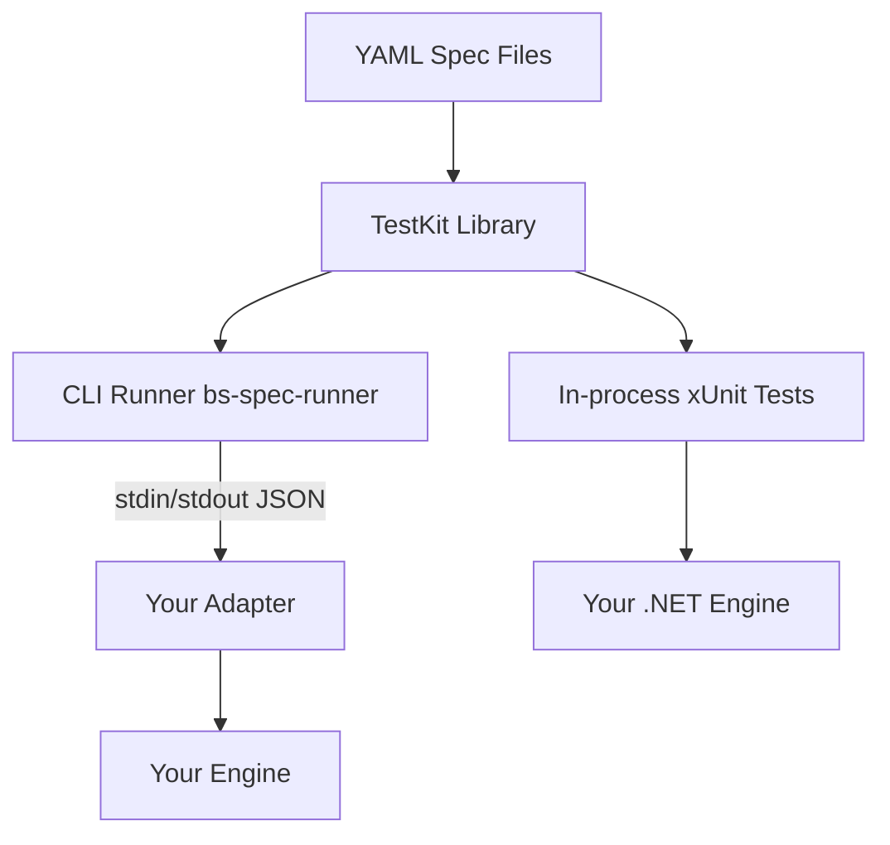

# BattleScribe Spec

A universal, declarative conformance test suite for BattleScribe roster engine implementations.
Any engine, in any language, can validate its behavior against 246 spec files covering the
complete BattleScribe data model and editing operations.

## Quick Start

### For .NET Engines (Recommended)

Reference the TestKit and run specs as xUnit tests:

```csharp
public class ConformanceTests
{
    public static IEnumerable<object[]> AllSpecs() =>
        SpecLoader.DiscoverEmbeddedSpecs()
            .Select(s => new object[] { s.Id, s });

    [Theory]
    [MemberData(nameof(AllSpecs))]
    public void Spec(string id, SpecFile spec)
    {
        var engine = new MyRosterEngine();
        var runner = new SpecRunner(engine);
        runner.Run(spec);
    }
}
```

### For Any Language

Write a thin [adapter](docs/adapter-protocol.md) that wraps your engine with the
JSON-line protocol, then run the CLI:

```bash
dotnet bs-spec-runner.dll \
  --adapter "/path/to/your-adapter" \
  --specs specs/ \
  --output summary
```

See the [Adapter Implementation Guide](docs/adapter-guide.md) for step-by-step instructions.

## Architecture



The spec suite is structured as layers (see [ADR 001](docs/adr/001-spec-test-kit-architecture.md)):

| Layer | Description |
|-------|-------------|
| **YAML Specs** | 246 declarative spec files covering all BattleScribe operations |
| **TestKit** | .NET library: spec loader, runner, assertion engine, protocol types |
| **CLI Runner** | Standalone console app that drives any adapter via JSON-line protocol |
| **Adapters** | Thin wrappers translating protocol commands to engine API calls |

## Spec Coverage

246 specs across 10 categories:

| Category | Specs | Description |
|----------|------:|-------------|
| condition | 31 | All condition types, groups, scopes, instanceOf, null-childId |
| constraint | 34 | Min/max validation, shared, percent, hidden, cost limits, linked errors |
| cost | 19 | Calculation, aggregation, limits, multi-type, negative |
| force | 11 | Add/remove, nested, categories, multi-catalogue |
| modifier | 48 | All modifier types, groups, repeats, profiles, rules, characteristics |
| real-world | 2 | DataSource specs using wh40k-10e external data |
| refresh | 10 | State refresh after every mutation type |
| roster | 9 | Creation, metadata, cost types |
| scope | 14 | All scope types, child ID filters, include flags |
| selection | 68 | Lifecycle, groups, links, collective, types, entry links, publications |

## Project Structure

```
battlescribe-spec/
├── specs/                          # 246 YAML spec files
├── src/
│   ├── BattleScribeSpec.TestKit/   # Portable library (IRosterEngine, SpecRunner, Protocol)
│   ├── BattleScribeSpec.Oracle/    # Oracle engine (IKVM + BattleScribe JARs)
│   ├── BattleScribeSpec.Runner/    # CLI runner (bs-spec-runner)
│   ├── BattleScribeSpec.ReferenceAdapter/  # Reference adapter (wraps oracle)
│   ├── BattleScribeSpec.NewRecruit/        # New Recruit adapter (Playwright)
│   └── BattleScribeSpec.NewRecruit.HarTool/  # HAR recording console tool
├── tests/
│   ├── Infrastructure/             # Test fixtures and helpers
│   ├── Conformance/                # YAML spec-driven conformance tests
│   ├── Oracle/                     # Reference oracle engine tests
│   ├── Features/                   # Domain feature tests
│   ├── Integration/                # End-to-end and real-world data tests
│   └── Regression/                 # Regression and protocol tests
├── docker/                         # Dockerfiles + compose
├── docs/                           # Protocol spec, guides, ADRs
└── BattleScribeSpec.slnx           # Solution file
```

## Documentation

- [Adapter Protocol Specification](docs/adapter-protocol.md) — JSON-line protocol reference
- [Adapter Implementation Guide](docs/adapter-guide.md) — Step-by-step adapter writing guide
- [Engine-Filtered Expected State](docs/engine-filtered-expected-state.md) — Per-engine assertion overrides
- [CI Integration Guide](docs/ci-guide.md) — GitHub Actions and CI setup
- [Frozen NR Testing](docs/frozen-nr-testing.md) — Offline New Recruit testing via HAR replay
- [ADR 001: Spec Test Kit Architecture](docs/adr/001-spec-test-kit-architecture.md) — Architecture decisions
- [Coverage Report](docs/comprehensive-engine-coverage-report.md) — Detailed coverage analysis

## Development

### Prerequisites

- .NET 10.0 SDK
- Git

### Setup

```powershell
# Clone data repositories (needed for real-world oracle tests)
./setup.ps1
```

### Build & Test

```bash
dotnet build
dotnet test
```

### Running Specific Test Suites

Use test profiles for one-command test runs:

```bash
dotnet test -p:TestProfile=nr-live          # live NR conformance + integration (sets NR_ENGINE_URL automatically)
dotnet test -p:TestProfile=nr-live-visible   # same, with visible browser window
dotnet test -p:TestProfile=nr-frozen         # frozen NR conformance (offline, needs ./setup.ps1)
dotnet test -p:TestProfile=oracle            # Oracle engine conformance
dotnet test -p:TestProfile=lint              # spec lint and structure checks
```

Profiles are `.runsettings` files in `tests/test-profiles/` — they set environment variables and test
filters automatically. You can also run suites manually with `--filter`:

| Suite | Command | Notes |
|-------|---------|-------|
| Oracle conformance | `dotnet test --filter "SpecConformanceTests"` | Always available |
| Frozen NR conformance | `dotnet test --filter "FrozenNewRecruitConformanceTests"` | Requires `./setup.ps1` (downloads HAR snapshot) |
| Live NR conformance | `dotnet test --filter "LiveNewRecruitConformanceTests"` | Requires `NR_ENGINE_URL` env var + `./setup.ps1` (installs Playwright) |
| Lint/formatting | `dotnet test --filter "SpecLintTests"` | Always available |
| Real-world data | `dotnet test --filter "RealWorldData"` | Requires `./setup.ps1` (downloads wh40k-9e) |

### Environment Variables

| Variable | Description | Example |
|----------|-------------|---------|
| `NR_ENGINE_URL` | Base URL for live New Recruit tests | `https://newrecruit.eu` |
| `NR_HEADLESS` | Set to `false` to show the browser window | `false` |
| `NR_FROZEN_SKIP` | Set to `true` to skip frozen NR tests | `true` |
| `NR_PARALLEL` | Number of parallel browser contexts | `5` |
| `NR_SEQUENTIAL` | Set to `true` to run sequential (per-spec) NR tests | `true` |

Example — run live NR conformance tests with visible browser:

```powershell
$env:NR_ENGINE_URL = "https://newrecruit.eu"
$env:NR_HEADLESS = "false"
dotnet test tests/BattleScribeSpec.Tests.csproj --filter "LiveNewRecruitConformanceTests"
```

### End-to-End Test

```bash
dotnet build
dotnet src/BattleScribeSpec.Runner/bin/Debug/net10.0/bs-spec-runner.dll \
  --adapter "dotnet:src/BattleScribeSpec.ReferenceAdapter/bin/Debug/net10.0/bs-reference-adapter.dll" \
  --specs specs \
  --output summary
```

## New Recruit Testing

The project includes a [New Recruit](https://newrecruit.eu) adapter that tests NR's conformance
via Playwright browser automation. Two testing modes are available:

- **Live** (`nr-conformance` CI job) — Tests against the live NR website. Triggered manually
  or with `[nr-test]` in commit message. Set `NR_ENGINE_URL=https://newrecruit.eu` to run locally.
- **Frozen** (`nr-frozen` CI job) — Tests against a pre-recorded HAR snapshot, fully offline.
  Runs automatically on every push. Run `./setup.ps1` to download the snapshot. Snapshots stored in
  [WarHub/newrecruit-har](https://github.com/WarHub/newrecruit-har).

See [Frozen NR Testing](docs/frozen-nr-testing.md) for details on recording, publishing,
and running frozen tests.

## Future Steps

- [ ] Publish TestKit as NuGet package
- [ ] Publish runner as Docker image to GHCR
- [ ] Publish runner as dotnet global tool

## License

See [LICENSE](LICENSE) for details.
