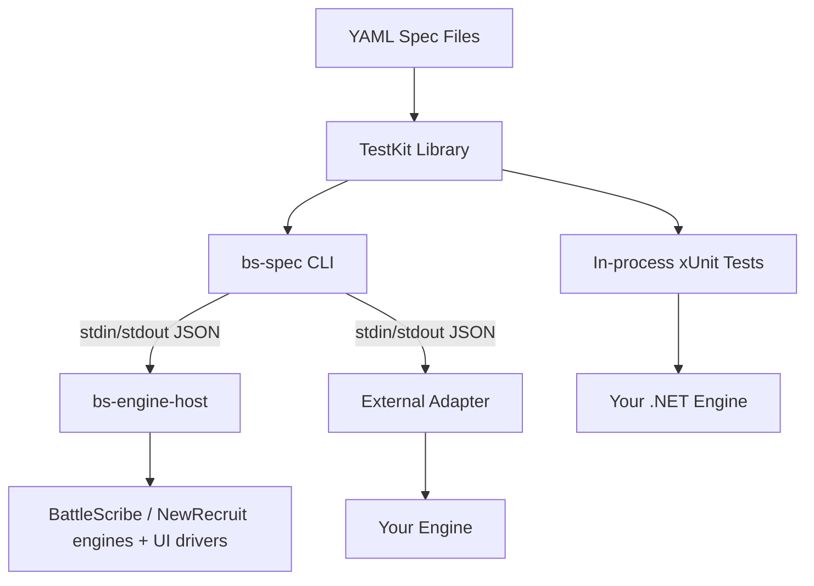

# BattleScribe Spec

A universal, declarative conformance test suite for BattleScribe roster engine implementations.
Any engine, in any language, can validate its behavior against 499 spec files — 380 roster specs
and 119 GameData specs — covering the complete BattleScribe data model and editing operations.

## Quick Start

### For .NET Engines (Recommended)

Reference the TestKit and run specs as xUnit tests:

```csharp
public class ConformanceTests
{
    public static IEnumerable<object[]> AllSpecs() =>
        SpecLoader.DiscoverEmbeddedSpecs()
            .Select(s => new object[] { s.Id, s });

    [Theory]
    [MemberData(nameof(AllSpecs))]
    public void Spec(string id, SpecFile spec)
    {
        var engine = new MyRosterEngine();
        var runner = new SpecRunner(engine);
        runner.Run(spec);
    }
}
```

### For Any Language

Write a thin [adapter](docs/adapter-protocol.md) that wraps your engine with the
JSON-line protocol, then run it through the `bs-spec` CLI with an `exec:`/`dotnet:`
connectable:

```bash
dotnet bs-spec.dll run --all \
  --engine "exec:/path/to/your-adapter" \
  --specs specs/ \
  --output summary
```

See the [Adapter Implementation Guide](docs/adapter-guide.md) for step-by-step instructions.

### The `bs-spec` CLI

`bs-spec` is engine-free: it speaks only the adapter protocol. The `--engine` option
selects what it talks to — a built-in name, a `name=connectable` alias from
`engines.json`, or an ad-hoc `exec:`/`dotnet:` connectable:

```bash
# Built-in in-process/API engines
bs-spec run selection/selection-page --engine battlescribe
bs-spec run selection/selection-page --engine newrecruit

# Built-in UI engines (drive the real desktop app / browser)
bs-spec run selection/selection-page --engine battlescribe-ui --headed
bs-spec run selection/selection-page --engine newrecruit-ui

# --ui is sugar for appending "-ui" to a plain built-in name
bs-spec run selection/selection-page --engine battlescribe --ui

# Any external adapter (dotnet DLL or arbitrary executable)
bs-spec run selection/selection-page --engine "dotnet:path/to/adapter.dll"
bs-spec run selection/selection-page --engine "myengine=exec:/path/to/adapter"

# An adapter the harness has never seen has an UNDECLARED endpoint, and an undeclared
# endpoint is treated as a third party's live service — held to a courtesy load limit on
# both axes. Say what your adapter drives and it takes the machine's full width. (Naming
# it after a built-in earns nothing: a name selects specs; it is not a measurement.)
bs-spec run --all --engine "myengine=exec:/path/to/adapter" --engine-endpoint local

# Full suite, matrix report
bs-spec run --all --engine battlescribe --report artifacts/battlescribe-conformance.json
```

Built-in engines (`battlescribe`, `battlescribe-ui`, `newrecruit`, `newrecruit-ui`) don't
run in the CLI process itself — the CLI resolves them and spawns **bs-engine-host**, an
in-box adapter process that hosts all four, over the same protocol used for external
adapters. `bs-spec probe` and `bs-spec discover` (interactive inspection / NR schema
discovery) always run this way, forwarding to `bs-engine-host` with inherited stdio.

Every `run --all`/`compare` also emits OpenTelemetry traces + metrics: a `.traces.pb`/`.metrics.pb`
artifact under `artifacts/telemetry/`, and a compact table (wall time, cold-starts vs warm-reuses,
peak live resources) printed after the run. `bs-spec compare` is how a config change (warm-reuse,
a parallelism level, ...) gets proven verdict-neutral before it ships — see
[Telemetry](docs/telemetry.md).

## Architecture



The spec suite is structured as layers (see [ADR 001](docs/adr/001-spec-test-kit-architecture.md)):

| Layer | Description |
|-------|-------------|
| **YAML Specs** | 499 declarative spec files (380 roster + 119 GameData) covering all BattleScribe operations |
| **TestKit** | .NET library: spec loader, runner, assertion engine, protocol types |
| **bs-spec CLI** | Engine-free console app: run/probe/verify/export-xml/format/discover |
| **bs-engine-host** | In-box adapter hosting the built-in engines (battlescribe, battlescribe-ui, newrecruit, newrecruit-ui) over the adapter protocol |
| **XmlGen** | `.cat`/`.gst`/`.ros` XML generation shared by the CLI's `export-xml` and bs-engine-host's `probe`/`discover` |
| **Adapters** | Thin wrappers (built-in or external) translating protocol commands to engine API calls |

## Spec Coverage

The suite covers two domains, and they are counted separately. **Roster** specs (`specs/roster/`)
drive a roster engine — add forces, select entries, assert the resulting roster state. **GameData**
specs (`specs/gamedata/`) drive a catalogue editor — create and edit `.cat`/`.gst` data, assert the
resulting model or the exact serialized file.

### Roster specs — 380 across 23 categories

| Category | Specs | Description |
|----------|------:|-------------|
| auto-select | 5 | Automatic selection with min constraints and defaults |
| catalogue | 5 | Catalogue-level category/force entries, cost types, profile types, root rules |
| category | 3 | Category links with modifiers, hidden category entries, uncategorised fallback |
| condition | 37 | All condition types, groups, scopes, instanceOf, null-childId |
| constraint | 45 | Min/max validation, shared, percent, hidden, cost limits, linked errors |
| cost | 27 | Calculation, aggregation, limits, multi-type, negative, hidden, fractional |
| customization | 3 | `customName`/`customNotes` on a force, a selection, and a category |
| deep-nesting | 6 | Cross-catalogue links, chained entry links, nested constraints |
| entry-group | 4 | Selection entry groups with links, categories, nesting |
| entry-id | 15 | How `entryId`/`entryGroupId` compose — direct entries, `linkId::targetId` for links, chained links, groups |
| entry-link | 3 | Entry links with children, collective, groups |
| export | 1 | Byte-compare of an exported `.ros` against a per-engine snapshot |
| force | 21 | Add/remove, nested, categories, multi-catalogue, multi-level |
| gamesystem | 4 | Game system root/shared entries, rules, publications |
| modifier | 63 | All modifier types, groups, repeats, profiles, rules, characteristics |
| ordering | 6 | Order of forces, selections and categories — alphabetical, natural sort, definition order |
| override | 1 | Per-engine override machinery: an action-input override composed with an expected-state override |
| protocol | 2 | Protocol smoke tests (kitchen sink, duplicate force) |
| real-world | 2 | DataSource specs using wh40k-10e external data |
| roster | 9 | Creation, metadata, cost types, lifecycle |
| roundtrip | 9 | Save + load fidelity — `reload` preserves state, `loadRoster` re-links a `.ros` payload, refuses the payloads it cannot, and records where the engines disagree about which those are |
| scope | 14 | All scope types, child ID filters, include flags |
| selection | 95 | Lifecycle, groups, links, collective, types, profiles, rules, info groups, publications |

### GameData specs — 119 across 23 categories

| Category | Specs | Description |
|----------|------:|-------------|
| category | 1 | Category entries with nested constraints and modifiers |
| comment | 1 | The `comment` (author note) field across data elements |
| condition | 3 | All condition types, condition groups, advanced query fields |
| constraint | 2 | Constraint creation and query fields (shared, percent, include-child) |
| cost | 3 | Cost values, fractional values, cost modifiers |
| entry | 50 | Selection/category/force entries and groups — creation, nesting, fields, deletion |
| export | 4 | Byte-compare of serialized `.cat`/`.gst` output against per-engine snapshots |
| force | 1 | Force entries: creation, nesting, category entries |
| info-group | 1 | Info groups with nested profiles and rules |
| load | 6 | Load-failure path: malformed XML and schema violations — what the editor refuses to parse, asserted with `expectFailure`, and the three violations it absorbs instead |
| links | 4 | Entry and catalogue links: types, targets, flags (collective, import, hidden) |
| modifier | 3 | Modifier types (string, list/category) and nested conditions |
| modifier-group | 1 | Modifier groups with nested modifiers and shared conditions |
| nr | 10 | NewRecruit-only extensions: associations, `exactly`, extended condition/modifier types |
| profile | 2 | Profiles: profile types, characteristics, metadata fields |
| publication | 1 | Publications and their metadata fields |
| repeat | 1 | Modifier repeats and their query fields |
| root | 2 | Catalogue and game system root metadata fields |
| roundtrip | 7 | Save + reload fidelity for edits and metadata |
| rule | 2 | Rules: fields and nested modifiers |
| shared | 1 | Shared root containers (entries, groups, rules, profiles) |
| type-def | 1 | Cost types, profile types, characteristic types |
| validation | 12 | Referential integrity and validation errors (broken links, bad scopes) |

## Project Structure

```
battlescribe-spec/
├── specs/                          # 499 YAML spec files (380 roster + 119 gamedata)
├── src/
│   ├── BattleScribeSpec.TestKit/   # Portable library (IRosterEngine, SpecRunner, Protocol)
│   ├── BattleScribeSpec.BattleScribe/    # BattleScribe engine (IKVM + BattleScribe JARs)
│   ├── BattleScribeSpec.Cli/      # Engine-free spec CLI (bs-spec: run/probe/verify/export-xml/format/discover)
│   ├── BattleScribeSpec.EngineHost/      # In-box adapter host (bs-engine-host) serving the built-in engines
│   ├── BattleScribeSpec.XmlGen/           # .cat/.gst/.ros XML generation (used by the CLI and bs-engine-host)
│   ├── BattleScribeSpec.BsRosterUiDriver/    # BattleScribe desktop UI driver (roster domain)
│   ├── BattleScribeSpec.BsGameDataUiDriver/  # BattleScribe desktop UI driver (gamedata domain)
│   ├── BattleScribeSpec.NrRosterUiDriver/    # New Recruit browser UI driver (roster domain, Playwright)
│   ├── BattleScribeSpec.NrGameDataUiDriver/  # New Recruit browser UI driver (gamedata domain, Playwright)
│   ├── BattleScribeSpec.ReferenceAdapter/  # Reference adapter (wraps BattleScribe)
│   ├── BattleScribeSpec.NewRecruit/        # New Recruit adapter (Playwright)
│   └── BattleScribeSpec.NewRecruit.HarTool/  # HAR recording console tool
├── tests/
│   ├── Infrastructure/             # Test fixtures and helpers
│   ├── Conformance/                # YAML spec-driven conformance tests
│   ├── BattleScribe/                     # BattleScribe engine tests
│   ├── Features/                   # Domain feature tests
│   ├── Integration/                # End-to-end and real-world data tests
│   └── Regression/                 # Regression and protocol tests
├── docker/                         # bs-spec Dockerfile + compose (engine-free image)
├── docs/                           # Protocol spec, guides, ADRs
└── BattleScribeSpec.slnx           # Solution file
```

## Documentation

- [Spec YAML Schema](docs/spec-schema.json) — JSON Schema for spec YAML files (enables IDE validation and autocompletion)
- [Adapter Protocol Specification](docs/adapter-protocol.md) — JSON-line protocol reference
- [Adapter Implementation Guide](docs/adapter-guide.md) — Step-by-step adapter writing guide
- [Engine-Filtered Expected State](docs/engine-filtered-expected-state.md) — Per-engine assertion overrides
- [CI Integration Guide](docs/ci-guide.md) — GitHub Actions and CI setup
- [Frozen NR Testing](docs/frozen-nr-testing.md) — Offline New Recruit testing via HAR replay
- [ADR 001: Spec Test Kit Architecture](docs/adr/001-spec-test-kit-architecture.md) — Architecture decisions
- [Coverage Report](docs/comprehensive-engine-coverage-report.md) — Detailed coverage analysis
- [Host Warm-Reuse](docs/warm-reuse.md) — Keeping a UI engine instance alive across specs, per-engine applicability, and measured speedups
- [Telemetry](docs/telemetry.md) — OpenTelemetry traces/metrics, the parent-as-collector architecture, reading the artifact, `bs-spec compare`, and known limitations

## Development

### Prerequisites

- .NET SDK — the exact band is pinned in [`global.json`](global.json) (`rollForward: latestPatch`),
  and CI installs from that file, so a local build and a CI build see the same analyzers. If
  `dotnet build` reports that no compatible SDK was found, install the version it names; the band is
  bumped by Dependabot, not by hand.
- Git

### Setup

```powershell
# Clone data repositories (needed for real-world BattleScribe tests)
./setup.ps1
```

### Build & Test

```bash
dotnet build
dotnet test
```

**AOT status:** `BattleScribeSpec.Cli` is analyzer-clean (`IsAotCompatible=true`, no
trim/AOT warnings), but a real `PublishAot=true` publish is blocked further upstream:
`dotnet publish src/BattleScribeSpec.Cli -c Release -p:PublishAot=true -r win-x64` fails
during restore with `NETSDK1207` on the vendored `.deps/wham` submodule's
`WarHub.ArmouryModel.Source.CodeGeneration` project (a `netstandard2.0` Roslyn source
generator pulled in transitively via XmlGen), since `-p:PublishAot=true` on the command
line is a global MSBuild property that cascades to every project in the graph, including
non-publishable source generators. `PublishAot` stays off by default; this is a smoke-test
finding, not a regression.

### Running Specific Test Suites

Use test profiles for one-command test runs:

```bash
dotnet test -p:TestProfile=nr-live          # live NR conformance + integration (sets NR_ENGINE_URL automatically)
dotnet test -p:TestProfile=nr-live-visible   # same, with visible browser window
dotnet test -p:TestProfile=nr-frozen         # frozen NR conformance (offline, needs ./setup.ps1)
dotnet test -p:TestProfile=bs            # BattleScribe engine conformance
dotnet test -p:TestProfile=lint              # spec lint and structure checks
```

Profiles are `.runsettings` files in `tests/test-profiles/` — they set environment variables and test
filters automatically. You can also run suites manually with `--filter`:

| Suite | Command | Notes |
|-------|---------|-------|
| BattleScribe conformance | `dotnet test --filter "SpecConformanceTests"` | Always available |
| Frozen NR conformance | `dotnet test --filter "FrozenNewRecruitConformanceTests"` | Requires `./setup.ps1` (downloads HAR snapshot) |
| Live NR conformance | `dotnet test --filter "LiveNewRecruitConformanceTests"` | Requires `NR_ENGINE_URL` env var + `./setup.ps1` (installs Playwright) |
| Lint/formatting | `dotnet test --filter "SpecLintTests"` | Always available |
| Real-world data | `dotnet test --filter "RealWorldData"` | Requires `./setup.ps1` (downloads wh40k-9e) |

### Environment Variables

| Variable | Description | Example |
|----------|-------------|---------|
| `NR_ENGINE_URL` | Base URL for live New Recruit tests | `https://www.newrecruit.eu` |
| `NR_HEADLESS` | Set to `false` to show the browser window | `false` |
| `NR_VISUAL` | Set to `true` to navigate to the roster editor UI after setup | `true` |
| `NR_SLOW_MO` | Playwright SlowMo in ms — pauses between browser actions | `500` |
| `NR_FROZEN_SKIP` | Set to `true` to skip frozen NR tests | `true` |
| `NR_SEQUENTIAL` | Set to `true` to run sequential (per-spec) NR tests | `true` |

Example — run live NR conformance tests with visible browser and roster editor UI:

```powershell
$env:NR_ENGINE_URL = "https://www.newrecruit.eu"
$env:NR_HEADLESS = "false"
$env:NR_VISUAL = "true"
dotnet test tests/BattleScribeSpec.Tests.csproj --filter "LiveNewRecruitConformanceTests"
```

Alternatively, use the `nr-live-visible` test profile which sets all three:

```bash
dotnet test -p:TestProfile=nr-live-visible
```

### End-to-End Test

```bash
dotnet build
dotnet artifacts/bin/BattleScribeSpec.Cli/debug/bs-spec.dll run --all \
  --engine "dotnet:artifacts/bin/BattleScribeSpec.ReferenceAdapter/debug/bs-reference-adapter.dll" \
  --specs specs \
  --output summary
```

Or against a built-in engine (spawns `bs-engine-host` under the hood):

```bash
dotnet artifacts/bin/BattleScribeSpec.Cli/debug/bs-spec.dll run --all --engine battlescribe --output summary
```

## New Recruit Testing

The project includes a [New Recruit](https://newrecruit.eu) adapter that tests NR's conformance
via Playwright browser automation. Two testing modes are available:

- **Live** (`nr-conformance` CI job) — Tests against the live NR website. Triggered manually
  or with `[nr-test]` in commit message. Set `NR_ENGINE_URL=https://www.newrecruit.eu` to run locally.
- **Frozen** (`nr-frozen` CI job) — Tests against a pre-recorded HAR snapshot, fully offline.
  Runs automatically on every push. Run `./setup.ps1` to download the snapshot. Snapshots stored in
  [WarHub/newrecruit-har](https://github.com/WarHub/newrecruit-har).

See [Frozen NR Testing](docs/frozen-nr-testing.md) for details on recording, publishing,
and running frozen tests.

## Future Steps

- [ ] Publish TestKit as NuGet package
- [ ] Publish `bs-spec` as a Docker image to GHCR
- [ ] Publish `bs-spec` as a dotnet global tool

## License

See [LICENSE](LICENSE) for details.
