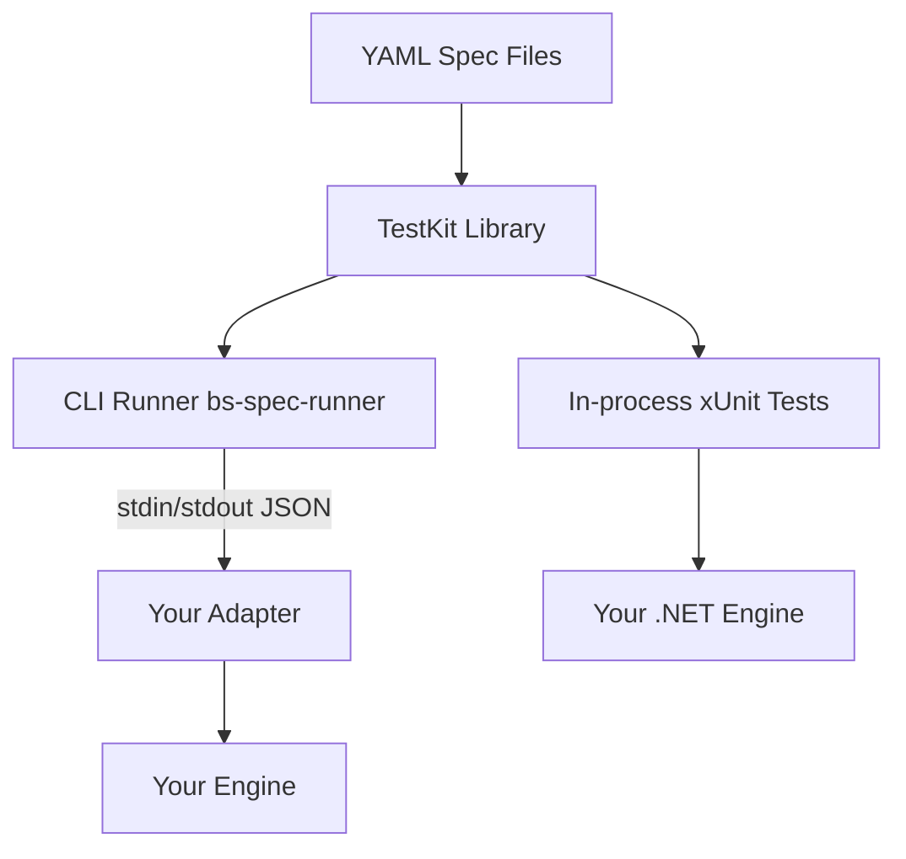

# BattleScribe Spec

A universal, declarative conformance test suite for BattleScribe roster engine implementations.
Any engine, in any language, can validate its behavior against 180+ spec files covering the
complete BattleScribe data model and editing operations.

## Quick Start

### For .NET Engines (Recommended)

Reference the TestKit and run specs as xUnit tests:

```csharp
public class ConformanceTests
{
    public static IEnumerable<object[]> AllSpecs() =>
        SpecLoader.DiscoverEmbeddedSpecs()
            .Select(s => new object[] { s.Id, s });

    [Theory]
    [MemberData(nameof(AllSpecs))]
    public void Spec(string id, SpecFile spec)
    {
        var engine = new MyRosterEngine();
        var runner = new SpecRunner(engine);
        runner.Run(spec);
    }
}
```

### For Any Language

Write a thin [adapter](docs/adapter-protocol.md) that wraps your engine with the
JSON-line protocol, then run the CLI:

```bash
dotnet bs-spec-runner.dll \
  --adapter "/path/to/your-adapter" \
  --specs specs/ \
  --output summary
```

See the [Adapter Implementation Guide](docs/adapter-guide.md) for step-by-step instructions.

## Architecture



The spec suite is structured as layers (see [ADR 001](docs/adr/001-spec-test-kit-architecture.md)):

| Layer | Description |
|-------|-------------|
| **YAML Specs** | 180 declarative spec files covering all BattleScribe operations |
| **TestKit** | .NET library: spec loader, runner, assertion engine, protocol types |
| **CLI Runner** | Standalone console app that drives any adapter via JSON-line protocol |
| **Adapters** | Thin wrappers translating protocol commands to engine API calls |

## Spec Coverage

180 specs across 10 categories:

| Category | Specs | Description |
|----------|-------|-------------|
| condition | 28 | All condition types, groups, scopes, instanceOf |
| constraint | 19 | Min/max validation, shared, percent, hidden, cost fields |
| cost | 17 | Calculation, aggregation, limits, multi-type, negative |
| force | 10 | Add/remove, nested, categories, multi-catalogue |
| modifier | 35 | All modifier types, groups, repeats, profiles, rules |
| refresh | 10 | State refresh after every mutation type |
| roster | 9 | Creation, metadata, cost types |
| scope | 14 | All scope types, child ID filters, include flags |
| selection | 25 | Lifecycle, groups, links, collective, types |
| coverage | 1 | Coverage matrix validation |

## Project Structure

```
battlescribe-spec/
├── specs/                          # 180 YAML spec files
├── src/
│   ├── BattleScribeSpec.TestKit/   # Portable library (IRosterEngine, SpecRunner, Protocol)
│   ├── BattleScribeSpec.csproj     # Oracle engine (IKVM + BattleScribe JARs)
│   ├── BattleScribeSpec.Runner/    # CLI runner (bs-spec-runner)
│   └── BattleScribeSpec.ReferenceAdapter/  # Reference adapter (wraps oracle)
├── tests/                          # xUnit tests using oracle engine
├── docker/                         # Dockerfiles + compose
├── docs/                           # Protocol spec, guides, ADRs
└── BattleScribeSpec.slnx           # Solution file
```

## Documentation

- [Adapter Protocol Specification](docs/adapter-protocol.md) — JSON-line protocol reference
- [Adapter Implementation Guide](docs/adapter-guide.md) — Step-by-step adapter writing guide
- [CI Integration Guide](docs/ci-guide.md) — GitHub Actions and CI setup
- [ADR 001: Spec Test Kit Architecture](docs/adr/001-spec-test-kit-architecture.md) — Architecture decisions
- [Coverage Report](docs/comprehensive-engine-coverage-report.md) — Detailed coverage analysis

## Development

### Prerequisites

- .NET 10.0 SDK
- Git

### Setup

```powershell
# Clone data repositories (needed for real-world oracle tests)
./setup.ps1
```

### Build & Test

```bash
dotnet build
dotnet test
```

### End-to-End Test

```bash
dotnet build
dotnet src/BattleScribeSpec.Runner/bin/Debug/net10.0/bs-spec-runner.dll \
  --adapter "dotnet:src/BattleScribeSpec.ReferenceAdapter/bin/Debug/net10.0/bs-reference-adapter.dll" \
  --specs specs \
  --output summary
```

## Future Steps

- [ ] Publish TestKit as NuGet package
- [ ] Publish runner as Docker image to GHCR
- [ ] Publish runner as dotnet global tool

## License

See [LICENSE](LICENSE) for details.
