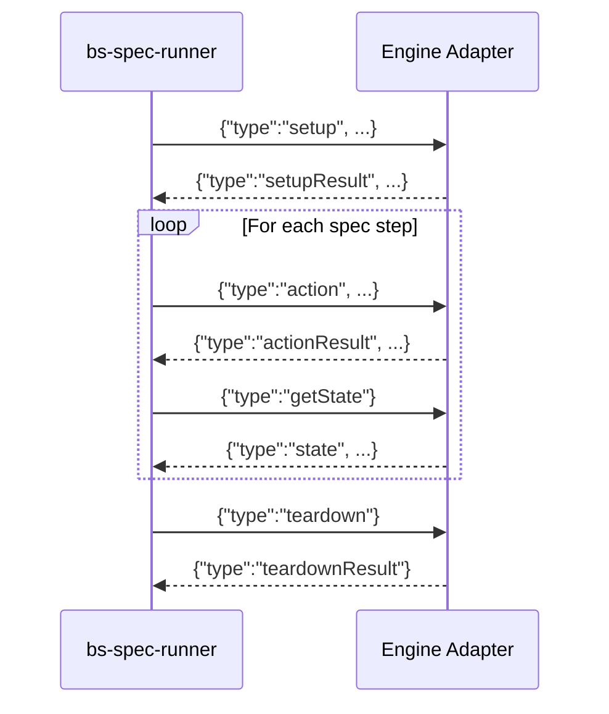

# BattleScribe Spec Adapter Protocol v1.0

This document defines the JSON-line protocol used for communication between the
**bs-spec-runner** (conformance test runner) and an **engine adapter** (a thin wrapper
around a BattleScribe-compatible roster editing engine).

## Overview

The runner launches the adapter as a child process and communicates via **stdin/stdout**
using NDJSON (newline-delimited JSON) — one JSON object per line.



## Protocol Rules

1. Each message is a single JSON object on exactly one line (no embedded newlines).
2. The adapter MUST NOT write anything to stdout except protocol response messages.
3. The adapter MAY write diagnostic information to stderr.
4. The runner sends exactly one command, then waits for exactly one response.
5. The `type` field discriminates message kinds.
6. Unknown fields should be ignored (forward compatibility).

## Runner → Adapter Commands

### `setup` — Initialize Engine

Sent once at the start of each spec test. Provides game system and catalogues data.

```json
{
  "type": "setup",
  "version": "1.0",
  "gameSystem": {
    "id": "test-gs",
    "name": "Test Game System",
    "costTypes": [
      { "id": "ct-pts", "name": "pts", "defaultCostLimit": -1.0, "hidden": false, "limit": false }
    ],
    "forceEntries": [
      {
        "id": "fe-1", "name": "Patrol",
        "categoryLinks": [{ "id": "cl-1", "targetId": "cat-1", "name": "HQ", "primary": false }],
        "forceEntries": []
      }
    ],
    "categoryEntries": [
      { "id": "cat-1", "name": "HQ" }
    ]
  },
  "catalogues": [
    {
      "id": "cat-1",
      "name": "Test Catalogue",
      "gameSystemId": "test-gs",
      "selectionEntries": [
        {
          "id": "se-1", "name": "Unit", "type": "unit", "hidden": false, "collective": false,
          "costs": [{ "name": "pts", "typeId": "ct-pts", "value": 50 }],
          "constraints": [], "modifiers": [], "modifierGroups": [],
          "selectionEntries": [], "selectionEntryGroups": [],
          "entryLinks": [], "categoryLinks": [], "rules": [], "profiles": [], "infoGroups": []
        }
      ],
      "selectionEntryGroups": [],
      "entryLinks": []
    }
  ]
}
```

### `action` — Execute Roster Action

| Action | Required Fields | Description |
|--------|----------------|-------------|
| `addForce` | `forceEntryIndex` | Add a force. Optional: `forcePath` (parent, default `[]` = top-level), `catalogueIndex` (default 0) |
| `removeForce` | `forcePath` or `forceIndex` | Remove a force identified by path |
| `selectEntry` | `entryIndex`, `forcePath` or `forceIndex` | Add a selection to a force |
| `selectChildEntry` | `childEntryIndex`, `forcePath`/`forceIndex`, `selectionPath`/`selectionIndex` | Add a child selection |
| `deselectSelection` | `forcePath`/`forceIndex`, `selectionPath`/`selectionIndex` | Remove a selection |
| `setSelectionCount` | `entryIndex`, `count`, `forcePath`/`forceIndex` | Set selection quantity |
| `duplicateSelection` | `forcePath`/`forceIndex`, `selectionPath`/`selectionIndex` | Duplicate a selection |
| `setCostLimit` | `costTypeId`, `value` | Set cost limit for a cost type |

#### Path-based addressing

Actions that target forces accept either a legacy `forceIndex` (integer) or a `forcePath`
(array of integers) for nested addressing. Similarly, selection-targeting actions accept
`selectionIndex` (integer) or `selectionPath` (array of integers).

| Parameter | Type | Description |
|-----------|------|-------------|
| `forcePath` | `int[]` | Path to a force in the hierarchy. For `addForce`: identifies the parent (empty `[]` = top-level). For all other actions: identifies the target force. |
| `selectionPath` | `int[]` | Path to a selection in the hierarchy. `[0]` = first selection, `[0, 2]` = third child of first selection. |
| `forceIndex` | `int` | Legacy shorthand for `forcePath: [N]`. Takes precedence if `forcePath` is absent. |
| `selectionIndex` | `int` | Legacy shorthand for `selectionPath: [N]`. Takes precedence if `selectionPath` is absent. |

Example:
```json
{"type":"action","action":"addForce","forceEntryIndex":0}
{"type":"action","action":"addForce","forcePath":[0],"forceEntryIndex":0}
{"type":"action","action":"selectEntry","forceIndex":0,"entryIndex":0}
{"type":"action","action":"selectEntry","forcePath":[0,1],"entryIndex":0}
{"type":"action","action":"setCostLimit","costTypeId":"ct-pts","value":500}
```

### `getState` — Query Roster State

```json
{"type":"getState"}
```

### `getErrors` — Query Validation Errors

```json
{"type":"getErrors"}
```

### `teardown` — End Test

Sent after each spec test completes. The adapter should reset its state.

```json
{"type":"teardown"}
```

## Adapter → Runner Responses

### `setupResult`

```json
{"type":"setupResult","errors":[]}
```

### `actionResult`

```json
{"type":"actionResult","ok":true}
{"type":"actionResult","ok":false,"error":"Force index out of range"}
```

### `state` — Full Roster State

```json
{
  "type": "state",
  "name": "New Roster",
  "gameSystemId": "test-gs",
  "forces": [
    {
      "name": "Patrol",
      "catalogueId": "cat-1",
      "selections": [
        {
          "name": "Unit",
          "entryId": "se-1",
          "type": "unit",
          "number": 1,
          "hidden": false,
          "costs": [{ "name": "pts", "typeId": "ct-pts", "value": 50 }],
          "children": []
        }
      ],
      "childForces": []
    }
  ],
  "costs": [{ "name": "pts", "typeId": "ct-pts", "value": 50 }],
  "validationErrors": [
    {
      "message": "Patrol must have 1 more selections of Unit A (minimum 1)",
      "ownerType": "category",
      "ownerId": "abc-123",
      "ownerEntryId": "cat-troops",
      "entryId": "se-unit-a",
      "constraintId": "con-min-1"
    }
  ]
}
```

Each validation error is a structured object with the following fields:

| Field | Type | Description |
|-------|------|-------------|
| `message` | string | Human-readable error message (always present) |
| `ownerType` | string? | Type of roster element: `"roster"`, `"force"`, `"category"`, `"selection"` |
| `ownerId` | string? | Runtime ID of the owning roster element |
| `ownerEntryId` | string? | Catalogue entry ID of the owner (for force/category/selection) |
| `entryId` | string? | ID of the entry whose constraint was violated, or `"costLimits"` for cost limit errors |
| `constraintId` | string? | ID of the constraint that failed, the cost type ID for cost limit errors, or `"hidden"` for hidden entry errors |

Null fields are omitted from the JSON.

#### Cost limit errors

When a roster exceeds a cost limit, the error uses a special convention:
- `ownerType` is `"roster"`
- `entryId` is `"costLimits"` (pseudo-entry)
- `constraintId` is the cost type ID (e.g., `"ct-pts"`)

```json
{
  "message": "Roster is over the pts limit by 50pts",
  "ownerType": "roster",
  "entryId": "costLimits",
  "constraintId": "ct-pts"
}
```

#### Hidden entry errors

When a hidden entry is selected, the error uses:
- `entryId` is the hidden entry's ID
- `constraintId` is `"hidden"` (pseudo-constraint)

```json
{
  "message": "Patrol cannot have any selections of Unit A (hidden)",
  "ownerType": "category",
  "ownerEntryId": "cat-troops",
  "entryId": "se-unit-a",
  "constraintId": "hidden"
}
```

### `errors`

```json
{
  "type": "errors",
  "errors": [
    {
      "message": "Patrol must have 1 more selections of Unit A (minimum 1)",
      "ownerType": "category",
      "ownerId": "abc-123",
      "ownerEntryId": "cat-troops",
      "entryId": "se-unit-a",
      "constraintId": "con-min-1"
    }
  ]
}
```

### `teardownResult`

```json
{"type":"teardownResult"}
```

### `error` — Protocol Error

Returned when the adapter encounters an unrecoverable error:

```json
{"type":"error","message":"Failed to initialize engine"}
```

## Data Type Reference

### Selection Entry

| Field | Type | Required | Description |
|-------|------|----------|-------------|
| `id` | string | yes | Unique identifier |
| `name` | string | yes | Display name |
| `type` | string | yes | One of: `unit`, `model`, `upgrade` |
| `hidden` | bool | yes | Whether hidden from selection |
| `collective` | bool | yes | Whether costs are collective |
| `costs` | CostValue[] | no | Associated costs |
| `constraints` | Constraint[] | no | Min/max constraints |
| `modifiers` | Modifier[] | no | Conditional modifiers |
| `modifierGroups` | ModifierGroup[] | no | Grouped conditional modifiers |
| `selectionEntries` | SelectionEntry[] | no | Child entries |
| `selectionEntryGroups` | SelectionEntryGroup[] | no | Child entry groups |
| `entryLinks` | EntryLink[] | no | Links to shared entries |
| `categoryLinks` | CategoryLink[] | no | Category associations |
| `rules` | Rule[] | no | Associated rules |
| `profiles` | Profile[] | no | Associated profiles |
| `infoGroups` | InfoGroup[] | no | Grouped info (profiles + rules) |
| `page` | string | no | Page reference |

### Modifier

| Field | Type | Required | Description |
|-------|------|----------|-------------|
| `type` | string | yes | `set`, `increment`, `decrement`, `append`, `add`, `remove` |
| `field` | string | yes | Target field (e.g., `hidden`, `name`, cost type ID) |
| `value` | string | yes | New/delta value |
| `conditions` | Condition[] | no | Conditions to evaluate |
| `conditionGroups` | ConditionGroup[] | no | Grouped conditions |
| `repeats` | Repeat[] | no | Repeat modifiers |

### Condition

| Field | Type | Required | Description |
|-------|------|----------|-------------|
| `type` | string | yes | `equalTo`, `notEqualTo`, `greaterThan`, `lessThan`, `atLeast`, `atMost`, `instanceOf` |
| `value` | number | yes | Comparison value |
| `field` | string | yes | `selections`, `forces`, `cost type ID` |
| `scope` | string | yes | `self`, `parent`, `roster`, `force`, `primary-category`, `primary-catalogue`, `ancestor` |
| `childId` | string | no | Filter to specific child type |
| `shared` | bool | no | Whether shared across catalogue |
| `includeChildSelections` | bool | no | Include nested selections |
| `includeChildForces` | bool | no | Include nested forces |
| `percentValue` | bool | no | Value is a percentage |

## Implementing an Adapter

An adapter is a program that:

1. Reads JSON lines from **stdin**
2. Parses the `type` field to determine the command
3. Dispatches to the native engine API
4. Writes a JSON response line to **stdout**
5. Repeats until stdin is closed or a `teardown` command is received

### Pseudocode

```
while line = readline(stdin):
    command = json_parse(line)
    match command.type:
        "setup":
            errors = engine.setup(command.gameSystem, command.catalogues)
            write(stdout, {"type":"setupResult","errors":errors})
        "action":
            try:
                dispatch_action(engine, command)
                write(stdout, {"type":"actionResult","ok":true})
            catch error:
                write(stdout, {"type":"actionResult","ok":false,"error":str(error)})
        "getState":
            state = engine.get_roster_state()
            write(stdout, state_to_json(state))
        "getErrors":
            errors = engine.get_validation_errors()
            write(stdout, {"type":"errors","errors":errors})
        "teardown":
            engine.dispose()
            write(stdout, {"type":"teardownResult"})
            engine = new_engine()  // ready for next spec
```

### Notes

- The adapter should handle multiple setup/teardown cycles (one per spec test).
- stderr is free for diagnostics — the runner ignores it.
- The runner may terminate the adapter process if it doesn't respond within a timeout.
