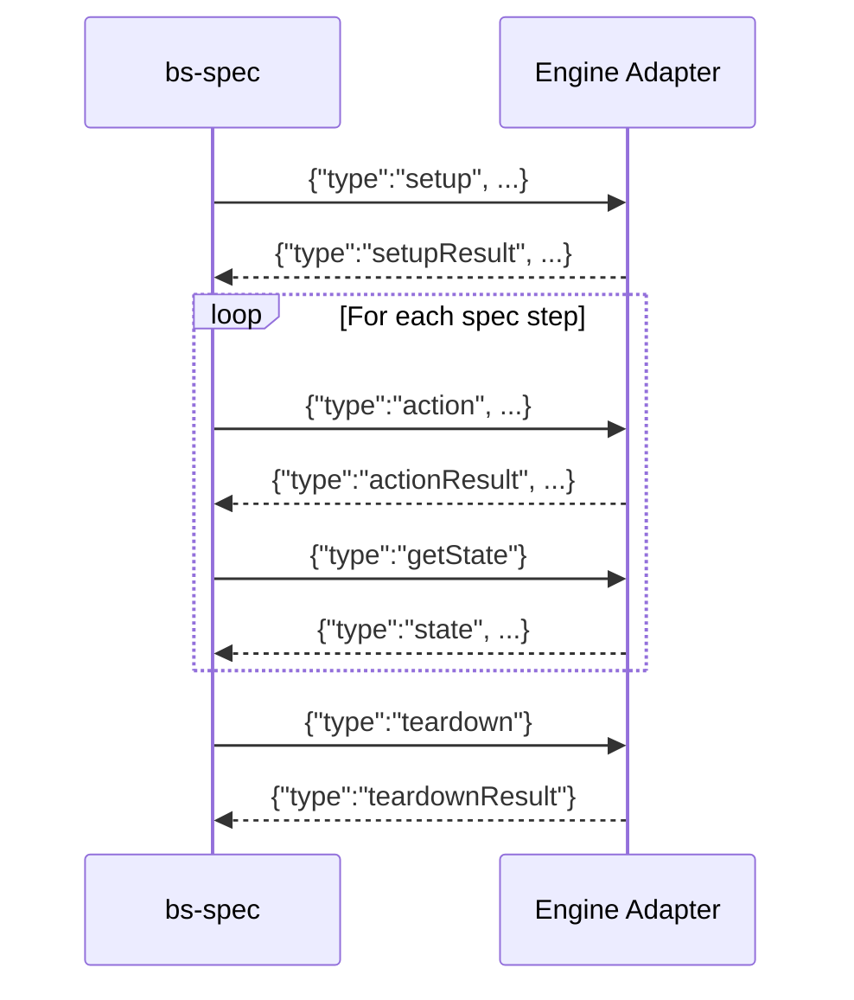

# BattleScribe Spec Adapter Protocol v1.1

This document defines the JSON-line protocol used for communication between the
**`bs-spec` CLI** (via `bs-engine-host` or any adapter) and an **engine adapter** (a thin wrapper
around a BattleScribe-compatible roster editing engine).

## Overview

The client (`bs-spec`, through `bs-engine-host` or an external adapter) launches the adapter as a child process and communicates via **stdin/stdout**
using NDJSON (newline-delimited JSON) — one JSON object per line.

The `bs-spec` CLI is itself engine-free — it speaks only this protocol. For the built-in
engines (`battlescribe`, `battlescribe-ui`, `newrecruit`, `newrecruit-ui`) it spawns
**bs-engine-host**, an in-box adapter process that serves all four over this same
protocol, exactly like any external adapter would.



## Protocol Rules

1. Each message is a single JSON object on exactly one line (no embedded newlines).
2. The adapter MUST NOT write anything to stdout except protocol response messages.
3. The adapter MAY write diagnostic information to stderr.
4. The client sends exactly one command, then waits for exactly one response.
5. The `type` field discriminates message kinds.
6. Unknown fields should be ignored (forward compatibility).

## Client → Adapter Commands

### `setup` — Initialize Engine

Sent once at the start of each spec test. Provides game system and catalogues data.

```json
{
  "type": "setup",
  "version": "1.0",
  "gameSystem": {
    "id": "test-gs",
    "name": "Test Game System",
    "costTypes": [
      { "id": "ct-pts", "name": "pts", "defaultCostLimit": -1.0, "hidden": false, "limit": false }
    ],
    "forceEntries": [
      {
        "id": "fe-1", "name": "Patrol",
        "categoryLinks": [{ "id": "cl-1", "targetId": "cat-1", "name": "HQ", "primary": false }],
        "forceEntries": []
      }
    ],
    "categoryEntries": [
      { "id": "cat-1", "name": "HQ" }
    ]
  },
  "catalogues": [
    {
      "id": "cat-1",
      "name": "Test Catalogue",
      "gameSystemId": "test-gs",
      "selectionEntries": [
        {
          "id": "se-1", "name": "Unit", "type": "unit", "hidden": false, "collective": false,
          "costs": [{ "name": "pts", "typeId": "ct-pts", "value": 50 }],
          "constraints": [], "modifiers": [], "modifierGroups": [],
          "selectionEntries": [], "selectionEntryGroups": [],
          "entryLinks": [], "categoryLinks": [], "rules": [], "profiles": [], "infoGroups": []
        }
      ],
      "selectionEntryGroups": [],
      "entryLinks": []
    }
  ]
}
```

### `setupFromFiles` — Initialize Engine from Files

Used for DataSource specs. Provides raw `.gst`/`.cat` XML file contents instead of
the structured protocol format. Adapters that do not support real-world data files
may return an error.

```json
{"type":"setupFromFiles","specId":"wh40k-10e-create-army","files":[{"fileName":"Warhammer40000.gst","content":"<?xml ...?>"},{"fileName":"SpaceMarines.cat","content":"<?xml ...?>"}]}
```

**Response:** same `setupResult` format as `setup`.

### `action` — Execute Roster Action

All addressing is **ID-based**. Definition references (e.g., `forceEntryId`, `entryId`)
use BattleScribe data model IDs from the setup data. Instance references (e.g., `forceId`,
`selectionId`) use IDs returned as `outputs` from previous mutating actions.

| Action | Required Fields | Outputs | Description |
|--------|----------------|---------|-------------|
| `addForce` | `forceEntryId` | `forceId`, `selections` | Add a top-level force. Optional: `catalogueId` |
| `addChildForce` | `forceId`, `forceEntryId` | `forceId`, `selections` | Add a child force under an existing force. Optional: `catalogueId` |
| `removeForce` | `forceId` | — | Remove a force by instance ID |
| `selectEntry` | `forceId`, `entryId` | `selectionId`, `selections` | Add a selection to a force |
| `selectChildEntry` | `forceId`, `selectionId`, `entryId` | `selectionId`, `selections` | Add a child selection under an existing selection |
| `deselectSelection` | `forceId`, `selectionId` | — | Remove a selection |
| `setSelectionCount` | `forceId`, `selectionId`, `count` | — | Set selection quantity |
| `duplicateSelection` | `forceId`, `selectionId` | `selectionId` | Duplicate a selection |
| `duplicateForce` | `forceId` | `forceId` | Duplicate a force (deep copy with all selections). Not supported by BattleScribe Java engine. |
| `setCostLimit` | `costTypeId`, `value` | — | Set cost limit for a cost type |

#### Action outputs

Mutating actions return an `outputs` object with IDs of created elements. The spec runner
flattens `outputs` onto the `steps.<stepId>` namespace, so if an adapter returns
`{"type":"actionResult","outputs":{"forceId":"f1"}}` for a step with `id: add-patrol`,
later steps reference that value as `${{ steps.add-patrol.forceId }}` (not
`${{ steps.add-patrol.outputs.forceId }}`).

| Output Field | Type | Returned by |
|-------------|------|-------------|
| `forceId` | string | `addForce`, `addChildForce`, `duplicateForce` |
| `selectionId` | string | `selectEntry`, `selectChildEntry`, `duplicateSelection` |
| `selections` | map(entryId → selectionId) | `addForce`, `addChildForce`, `selectEntry`, `selectChildEntry` — auto-selected child entries |

#### ID-based addressing

| Parameter | Type | Description |
|-----------|------|-------------|
| `forceEntryId` | string | BattleScribe force entry definition ID (from setup data) |
| `entryId` | string | BattleScribe selection entry definition ID (from setup data) |
| `catalogueId` | string | Catalogue definition ID (when multiple catalogues exist) |
| `forceId` | string | Force instance ID (from a prior action's `outputs.forceId`) |
| `selectionId` | string | Selection instance ID (from a prior action's `outputs.selectionId`) |
| `costTypeId` | string | Cost type definition ID (from setup data) |

Example:
```json
{"type":"action","action":"addForce","forceEntryId":"fe-battalion"}
{"type":"action","action":"selectEntry","forceId":"abc-123","entryId":"se-infantry"}
{"type":"action","action":"selectChildEntry","forceId":"abc-123","selectionId":"sel-456","entryId":"se-trooper"}
{"type":"action","action":"duplicateSelection","forceId":"abc-123","selectionId":"sel-456"}
{"type":"action","action":"duplicateForce","forceId":"abc-123"}
{"type":"action","action":"setCostLimit","costTypeId":"ct-pts","value":500}
```

### `getState` — Query Roster State

```json
{"type":"getState"}
```

### `getErrors` — Query Validation Errors

```json
{"type":"getErrors"}
```

### `teardown` — End Test

Sent after each spec test completes. The adapter should reset its state.

```json
{"type":"teardown"}
```

### `describe` — Capability Handshake (v1.1)

Sent once after process start, before `setup`. The adapter answers with its identity, the
protocol version it speaks, the spec domains it supports, and optional capabilities.

```json
{"type":"describe"}
```

Response:

```json
{"type":"describeResult","name":"battlescribe","version":"2.03.29","protocolVersion":"1.1","domains":["roster","gamedata"],"capabilities":{"screenshot":false,"record":false,"rosterXml":false,"maxParallel":0}}
```

Adapters predating v1.1 answer `describe` with an `error` response; runners MUST treat that
as protocol 1.0, roster-only, no optional capabilities. Adapters SHOULD answer `describe`;
all v1.1 messages are optional beyond it.

### Optional v1.1 commands

These four commands give the spec runner roster parity with the engine's own UI: capturing a
screenshot, exporting the current roster as `.ros` XML, and recording/replaying UI actions.
Support for each is advertised via `describeResult.capabilities` (`screenshot`, `rosterXml`,
`record`). An adapter that does not implement a command answers with an `error` response
(`"<type> is not supported by this adapter"`); the runner maps that to a NotSupported result
rather than failing the spec.

#### `screenshot`

```json
{"type":"screenshot"}
{"type":"screenshotResult","pngBase64":"iVBORw0KGgo..."}
```

#### `exportRosterXml`

```json
{"type":"exportRosterXml"}
{"type":"rosterXmlResult","xml":"<roster>...</roster>"}
```

#### `recordStart`

```json
{"type":"recordStart"}
{"type":"actionResult","ok":true}
```

#### `recordStop`

```json
{"type":"recordStop"}
{"type":"recordResult","actionsJson":"[{\"type\":\"click\",\"target\":\"#unit-1\"}]"}
```

## Adapter → Client Responses

### `setupResult`

```json
{"type":"setupResult","errors":[]}
```

### `actionResult`

```json
{"type":"actionResult","ok":true,"outputs":{"forceId":"abc-123","selections":{"se-required":"sel-789"}}}
{"type":"actionResult","ok":true,"outputs":{"selectionId":"sel-456"}}
{"type":"actionResult","ok":true}
{"type":"actionResult","ok":false,"error":"Force not found with id 'xyz'"}
```

The `outputs` field is present on success for mutating actions that create elements.
It contains the IDs described in [Action outputs](#action-outputs) above. The spec runner
flattens each `outputs` property onto the step's expression namespace — e.g.,
`outputs.forceId` becomes `${{ steps.<stepId>.forceId }}`.

### `state` — Full Roster State

```json
{
  "type": "state",
  "name": "New Roster",
  "gameSystemId": "test-gs",
  "forces": [
    {
      "name": "Patrol",
      "catalogueId": "cat-1",
      "selections": [
        {
          "name": "Unit",
          "entryId": "se-1",
          "type": "unit",
          "number": 1,
          "hidden": false,
          "costs": [{ "name": "pts", "typeId": "ct-pts", "value": 50 }],
          "children": []
        }
      ],
      "childForces": []
    }
  ],
  "costs": [{ "name": "pts", "typeId": "ct-pts", "value": 50 }],
  "validationErrors": [
    {
      "message": "Patrol must have 1 more selections of Unit A (minimum 1)",
      "ownerType": "category",
      "ownerId": "abc-123",
      "ownerEntryId": "cat-troops",
      "entryId": "se-unit-a",
      "constraintId": "con-min-1"
    }
  ]
}
```

Each validation error is a structured object with the following fields:

| Field | Type | Description |
|-------|------|-------------|
| `message` | string | Human-readable error message (always present) |
| `ownerType` | string? | Type of roster element: `"roster"`, `"force"`, `"category"`, `"selection"` |
| `ownerId` | string? | Runtime ID of the owning roster element |
| `ownerEntryId` | string? | Catalogue entry ID of the owner (for force/category/selection) |
| `entryId` | string? | ID of the entry whose constraint was violated, or `"costLimits"` for cost limit errors |
| `constraintId` | string? | ID of the constraint that failed, the cost type ID for cost limit errors, or `"hidden"` for hidden entry errors |

Null fields are omitted from the JSON.

#### Cost limit errors

When a roster exceeds a cost limit, the error uses a special convention:
- `ownerType` is `"roster"`
- `entryId` is `"costLimits"` (pseudo-entry)
- `constraintId` is the cost type ID (e.g., `"ct-pts"`)

```json
{
  "message": "Roster is over the pts limit by 50pts",
  "ownerType": "roster",
  "entryId": "costLimits",
  "constraintId": "ct-pts"
}
```

#### Hidden entry errors

When a hidden entry is selected, the error uses:
- `entryId` is the hidden entry's ID
- `constraintId` is `"hidden"` (pseudo-constraint)

```json
{
  "message": "Patrol cannot have any selections of Unit A (hidden)",
  "ownerType": "category",
  "ownerEntryId": "cat-troops",
  "entryId": "se-unit-a",
  "constraintId": "hidden"
}
```

### `errors`

```json
{
  "type": "errors",
  "errors": [
    {
      "message": "Patrol must have 1 more selections of Unit A (minimum 1)",
      "ownerType": "category",
      "ownerId": "abc-123",
      "ownerEntryId": "cat-troops",
      "entryId": "se-unit-a",
      "constraintId": "con-min-1"
    }
  ]
}
```

### `teardownResult`

```json
{"type":"teardownResult"}
```

### `error` — Protocol Error

Returned when the adapter encounters an unrecoverable error:

```json
{"type":"error","message":"Failed to initialize engine"}
```

## Data Type Reference

### Selection Entry

| Field | Type | Required | Description |
|-------|------|----------|-------------|
| `id` | string | yes | Unique identifier |
| `name` | string | yes | Display name |
| `type` | string | yes | One of: `unit`, `model`, `upgrade` |
| `hidden` | bool | yes | Whether hidden from selection |
| `collective` | bool | yes | Whether costs are collective |
| `costs` | CostValue[] | no | Associated costs |
| `constraints` | Constraint[] | no | Min/max constraints |
| `modifiers` | Modifier[] | no | Conditional modifiers |
| `modifierGroups` | ModifierGroup[] | no | Grouped conditional modifiers |
| `selectionEntries` | SelectionEntry[] | no | Child entries |
| `selectionEntryGroups` | SelectionEntryGroup[] | no | Child entry groups |
| `entryLinks` | EntryLink[] | no | Links to shared entries |
| `categoryLinks` | CategoryLink[] | no | Category associations |
| `rules` | Rule[] | no | Associated rules |
| `profiles` | Profile[] | no | Associated profiles |
| `infoGroups` | InfoGroup[] | no | Grouped info (profiles + rules) |
| `page` | string | no | Page reference |

### Modifier

| Field | Type | Required | Description |
|-------|------|----------|-------------|
| `type` | string | yes | `set`, `increment`, `decrement`, `append`, `add`, `remove` |
| `field` | string | yes | Target field (e.g., `hidden`, `name`, cost type ID) |
| `value` | string | yes | New/delta value |
| `conditions` | Condition[] | no | Conditions to evaluate |
| `conditionGroups` | ConditionGroup[] | no | Grouped conditions |
| `repeats` | Repeat[] | no | Repeat modifiers |

### Condition

| Field | Type | Required | Description |
|-------|------|----------|-------------|
| `type` | string | yes | `equalTo`, `notEqualTo`, `greaterThan`, `lessThan`, `atLeast`, `atMost`, `instanceOf` |
| `value` | number | yes | Comparison value |
| `field` | string | yes | `selections`, `forces`, `cost type ID` |
| `scope` | string | yes | `self`, `parent`, `roster`, `force`, `primary-category`, `primary-catalogue`, `ancestor` |
| `childId` | string | no | Filter to specific child type |
| `shared` | bool | no | Whether shared across catalogue |
| `includeChildSelections` | bool | no | Include nested selections |
| `includeChildForces` | bool | no | Include nested forces |
| `percentValue` | bool | no | Value is a percentage |

## Implementing an Adapter

An adapter is a program that:

1. Reads JSON lines from **stdin**
2. Parses the `type` field to determine the command
3. Dispatches to the native engine API
4. Writes a JSON response line to **stdout**
5. Repeats until stdin is closed or a `teardown` command is received

### Pseudocode

```
while line = readline(stdin):
    command = json_parse(line)
    match command.type:
        "setup":
            errors = engine.setup(command.gameSystem, command.catalogues)
            write(stdout, {"type":"setupResult","errors":errors})
        "action":
            try:
                dispatch_action(engine, command)
                write(stdout, {"type":"actionResult","ok":true})
            catch error:
                write(stdout, {"type":"actionResult","ok":false,"error":str(error)})
        "getState":
            state = engine.get_roster_state()
            write(stdout, state_to_json(state))
        "getErrors":
            errors = engine.get_validation_errors()
            write(stdout, {"type":"errors","errors":errors})
        "teardown":
            engine.dispose()
            write(stdout, {"type":"teardownResult"})
            engine = new_engine()  // ready for next spec
```

### Notes

- The adapter should handle multiple setup/teardown cycles (one per spec test).
- stderr is free for diagnostics — the runner ignores it.
- The runner may terminate the adapter process if it doesn't respond within a timeout.

## GameData Protocol (data-file editing)

The protocol above tests **roster building** from fixed data. **GameData specs** (`specs/gamedata/`)
test the inverse: **editing the data files themselves** — adding/removing entries, setting fields,
costs and characteristics, linking, saving and reloading. The data *is* the editable artifact.

### Contract: `IGameDataEngine`

GameData conformance is defined by the **`IGameDataEngine`** interface. Most engines implement it
**in-process with no serialization** — the in-process BattleScribe reference (via IKVM) and both
NewRecruit Editor drivers (`newrecruit` store-direct and `newrecruit-ui`, both via Playwright). As of
protocol **v1.1**, the interface is also fully carried over the roster NDJSON wire via four commands —
`gamedataSetup`, `gamedataAction`, `gamedataGetState`, `gamedataGetErrors` — so an **external**
adapter process can serve the gamedata domain alongside (or instead of) roster, advertised via
`describeResult.domains`. Adapters that don't support gamedata simply omit it from `domains`; then
`gamedataSetup`, `gamedataGetState`, and `gamedataGetErrors` answer with an `error` response, and
`gamedataAction` answers `gamedataActionResult` with `ok:false` and an `error` message. The BattleScribe Data Editor (`battlescribe-ui`)
additionally exposes a JSON-RPC 2.0 wire (below), but that is the Java agent's own internal transport —
externally it is driven the same way as any other engine, through the four commands above.

| Operation | Inputs | Output | Notes |
|-----------|--------|--------|-------|
| `Setup` | gameSystem, catalogues | errors[] | Load the initial editable data (same shapes as roster `setup`) |
| `OpenFile` | `id` | — | Select the active file (catalogue or game system) for subsequent edits |
| `AddEntry` | `parentId`, `entryType`, `name?`, `id?` | `entryId` | Add an entry; **`id` is the declared id** to assign (see below) |
| `AddLink` | `parentId`, `linkType`, `targetId`, `id?` | `entryId` | Add an entry/info/category link; `id` is the declared id |
| `RemoveEntry` | `entryId` | — | Remove an entry by id |
| `SetField` | `entryId`, `field`, `value` | — | Set a scalar field (`name`, `hidden`, `type`, …) |
| `SetCost` | `entryId`, `costTypeId`, `value` | — | Set/clear a cost, keyed by cost type |
| `SetCharacteristic` | `entryId`, `nameOrTypeId`, `value` | — | Set/clear a profile characteristic |
| `Reload` | — | — | Serialize the active file to `.cat`/`.gst` and load it back (round-trip) |
| `ExportActiveFile` | — | xml | Exact serialized XML of the active file; type read from the root element |
| `LoadFile` | xml | `id` | Load a catalogue/game system from XML and open it; returns the loaded root id |
| `GetState` | — | state | Structural snapshot (game system + catalogues) |
| `GetValidationErrors` | — | errors[] | Validation errors (e.g. broken link targets) |

### GameData wire (v1.1): `gamedataSetup` / `gamedataAction` / `gamedataGetState` / `gamedataGetErrors`

`JsonProtocolGameDataEngine` maps `IGameDataEngine` 1:1 onto these four NDJSON commands (the
`AdapterHandler` counterpart dispatches them to an `AdapterOptions.GameDataEngineFactory`, mirroring
`setup`/`action`/`getState`/`getErrors` for roster). An adapter without a gamedata engine answers
`gamedataSetup`, `gamedataGetState`, and `gamedataGetErrors` with `error`; `gamedataAction` answers
`gamedataActionResult` with `ok:false` and an `error` message.

#### `gamedataSetup`

```json
{"type":"gamedataSetup","specId":"gd-add-entry","gameSystem":{"id":"gs","name":"GS"},"catalogues":[{"id":"cat-1","name":"Cat","gameSystemId":"gs"}]}
{"type":"setupResult","errors":[]}
```

#### `gamedataAction`

One command per `IGameDataEngine` mutation, selected by `action`; unused fields are omitted. Successful
mutations answer `gamedataActionResult` with `ok:true` and any produced id/xml; failures set `ok:false`
with `error`.

```json
{"type":"gamedataAction","action":"openFile","id":"cat-1"}
{"type":"gamedataActionResult","ok":true}
```

```json
{"type":"gamedataAction","action":"addEntry","parentId":"cat-1","entryType":"selectionEntry","name":"Unit","id":"se-new"}
{"type":"gamedataActionResult","ok":true,"entryId":"se-new"}
```

```json
{"type":"gamedataAction","action":"setField","entryId":"se-new","field":"name","value":"Renamed Unit"}
{"type":"gamedataActionResult","ok":true}
```

```json
{"type":"gamedataAction","action":"exportFile"}
{"type":"gamedataActionResult","ok":true,"xml":"<catalogue .../>"}
```

#### `gamedataGetState`

```json
{"type":"gamedataGetState"}
{"type":"gamedataState","state":{"catalogues":[{"id":"cat-1","name":"Cat","gameSystemId":"gs","selectionEntries":[{"id":"se-new","name":"Renamed Unit","entryType":"selectionEntry","children":[]}]}]}}
```

#### `gamedataGetErrors`

```json
{"type":"gamedataGetErrors"}
{"type":"errors","errors":[]}
```

### Active file (`setup.edit`)

Engines disagree on which loaded file is "active" by default (the reference and the Data Editor open
the **first** catalogue; NewRecruit the **last**). So every spec declares the file it edits with a
required **`setup.edit`** — a catalogue id or the game system id. After `Setup`, the runner calls
`OpenFile(setup.edit)` so the active file (what mutations, `Reload`, and `expectedFile` export apply to)
is deterministic across engines; an `openFile` step may switch it later. `OpenFile` is idempotent, so
re-opening the already-active single file is a no-op.

### Declared ids (byte-reproducible exports)

`AddEntry` / `AddLink` accept an **optional `id`** — the id to assign the created node (all editors
allow overriding the generated id). The action echoes it back as `entryId`. Specs that assert exact
serialized output declare ids so the export is reproducible; later steps can reference a created id via
`${{ steps.<step-id>.entryId }}`.

### File export & snapshot assertions

`ExportActiveFile` returns the open file's **exact** BattleScribe XML — the editor's own serialization.
A spec step with `expectedFile` compares it **byte-for-byte** (only `\r\n`→`\n` normalized on read)
against the expected content, which may be inline (`content:`) or a side-file next to the spec keyed by
the step `id`. Side-files resolve in three tiers (`ext` ∈ `cat`/`gst`, from the root element):

1. **Base** `{specId}.{stepId}.{ext}` — the **NewRecruit** output. The store-direct `newrecruit` and
   `newrecruit-ui` engines serialize through NR's own writer, so their output is identical and shares
   the base.
2. **Family override** `{specId}.{stepId}.{family}.{ext}` — one file per editor *family* (an engine name
   with any `-ui` suffix stripped, e.g. `battlescribe`). The headless reference and the real Data Editor
   share the same BattleScribe serializer, so `battlescribe` and `battlescribe-ui` normally share the
   `.battlescribe.` override; it exists only where that serializer diverges from NR's.
3. **Exact override** `{specId}.{stepId}.{engine}.{ext}` — a single engine (full name, e.g.
   `battlescribe-ui`), resolved before the family file. A safety net for a variant that genuinely
   diverges from its family-canonical engine; in practice unused, because **`{driver}` and
   `{driver}-ui` are required to produce identical files** — the in-process `battlescribe` engine
   replicates the Data Editor's on-load normalization (e.g. filling a zero cost for every cost type)
   so it matches `battlescribe-ui` byte-for-byte rather than carrying its own snapshot.

Resolution prefers exact → family → base; the writer keeps each tier minimal (no override is written
when an engine matches the tier above it). `BSSPEC_UPDATE_SNAPSHOTS=1` (or `bs-spec run
--update-snapshots`) (re)writes the side-files; generate the base first, then the family-canonical
engine, then variants.

### Open / load mid-spec

The `openFile` spec action either opens an already-loaded file by `entryId`, or loads a new file from a
source — inline `content:` XML, or a side-file keyed by the step `id` — via `LoadFile`, then opens it.
The file type (catalogue vs game system) is always derived from the XML root element; no type flag is
sent.

### BattleScribe Data Editor wire (JSON-RPC 2.0)

This is the `battlescribe-ui` in-process driver's **internal** transport to the Java agent, distinct
from the NDJSON `gamedataSetup`/`gamedataAction`/`gamedataGetState`/`gamedataGetErrors` commands above
(which is what an external adapter process implements). The `battlescribe-ui` Java agent is driven over
**stdio with JSON-RPC 2.0** — one JSON object per line,
`{"jsonrpc":"2.0","method":…,"id":…,"params":{…}}` → `{"jsonrpc":"2.0","id":…,"result":{…}}` or
`{…,"error":{"code":-32603,"message":…}}` on a handler throw. XML is carried as a plain JSON string.

| Method | params | result |
|--------|--------|--------|
| `gamedataLoadFilesAction` | `gstPath`, `catPaths[]` | `{}` |
| `gamedataOpenFileAction` | `path` | `{}` — open/load the staged file at `path` (backs both `OpenFile` and `LoadFile`) |
| `gamedataAddEntryAction` | `parentId`, `entryType`, `name?`, `entryId?` | `{"entryId":…}` |
| `gamedataAddLinkAction` | `parentId`, `linkType`, `targetId`, `entryId?` | `{"entryId":…}` |
| `gamedataRemoveEntryAction` | `entryId` | `{}` |
| `gamedataSetFieldAction` | `entryId`, `field`, `value` | `{}` |
| `gamedataSetCostAction` | `entryId`, `field` (cost type id), `value` | `{}` |
| `gamedataSetCharacteristicAction` | `entryId`, `field` (name or type id), `value` | `{}` |
| `gamedataSaveAndReloadAction` | — | `{}` — serialize the open file and reopen it |
| `gamedataExportFileAction` | — | `{"xml":…}` |
| `gamedataGetDataState` | — | `{"gameSystem":…?,"catalogues":[…]}` |
| `gamedataGetErrors` | — | `{"errors":[{"message":…}, …]}` |

C# maps `OpenFile(id)`/`LoadFile(xml)` onto `gamedataOpenFileAction` by staging the file to a path
(`{id}.cat` or `system.gst`) and parsing the root id locally. `gamedataExportFileAction` calls the
editor's own serializer, so its XML is byte-for-byte what the BattleScribe Data Editor writes.
