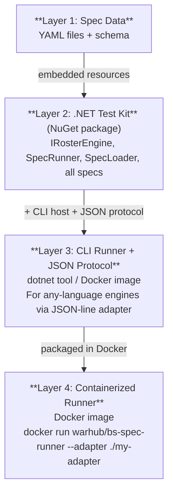
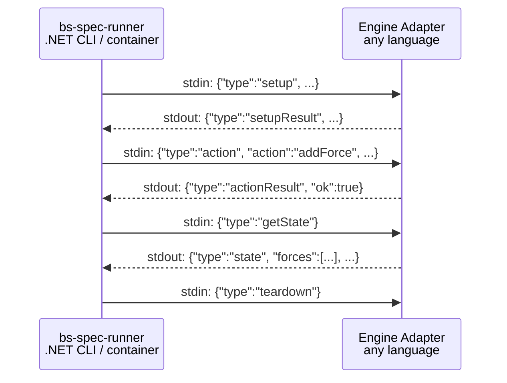

# ADR 001: Spec Test Kit Architecture — stdin/stdout JSON-line Protocol + NuGet Package

- **Status:** Accepted
- **Date:** 2026-03-01
- **Deciders:** amis92

## Context

The BattleScribe conformance spec suite (`battlescribe-spec`) validates roster-editing engine
behavior against 179 declarative YAML specs using the original Java BattleScribe engine as an
oracle (via IKVM.NET). The current architecture requires every engine under test to implement
`IRosterEngine` **in C#** and run inside the same .NET process. This limits the spec suite to
.NET engines only.

**The problem:** An engine written in Rust, TypeScript, Java, Python, or any non-.NET language
cannot participate without writing a C# wrapper or some cross-language bridge.

**The goal:** Make the spec test kit consumable by any engine in any language, ideally as a
containerized runner that produces detailed conformance results — similar to established
conformance suites like the [ConnectRPC Conformance Suite](https://github.com/connectrpc/conformance),
[YAML Test Suite](https://github.com/yaml/yaml-test-suite), and
[JSON Schema Test Suite](https://github.com/json-schema-org/JSON-Schema-Test-Suite).

### Key Constraint

The `SpecRunner` assertion logic (~630 lines of recursive matching for nested forces,
selections, costs, and validation errors) must **not** be reimplemented per engine. Any
architecture that requires each engine author to reimplement the runner defeats the purpose of
a conformance suite, as subtle interpretation differences would lead to false positives/negatives.

## Decision

Implement a **layered architecture** combining two complementary options:

**Layer 2 — NuGet Package (for .NET engines):**
Extract the spec runner as a `BattleScribeSpec.TestKit` NuGet package. .NET engine authors
install it, implement `IRosterEngine`, and get conformance testing for free.

**Layer 3 — stdin/stdout JSON-line Protocol (for any-language engines):**
Build a standalone .NET CLI runner (`BattleScribeSpec.Runner`) that communicates with any
engine via a JSON-line protocol over stdin/stdout. The engine author provides a small adapter
binary (~200 lines in any language).

**Layer 4 — Containerized Runner:**
Package the CLI runner as a Docker image (`warhub/bs-spec-runner`) so any CI/CD pipeline can
validate engine conformance without installing the .NET SDK.

### Architecture Diagram

### JSON-line Protocol (stdin/stdout)

Each message is a single JSON object on one line (NDJSON format). The runner launches the
adapter as a child process and communicates over stdin/stdout.

**Runner → Adapter commands:**

| Message Type | Description | Maps to |
|-------------|-------------|---------|
| `setup` | Initialize engine with game system + catalogue | `IRosterEngine.Setup()` |
| `action` | Execute a roster editing action | `AddForce`, `SelectEntry`, etc. |
| `getState` | Query full roster state | `GetRosterState()` |
| `getErrors` | Query validation errors | `GetValidationErrors()` |
| `teardown` | Signal end of test | `Dispose()` |

**Adapter → Runner responses:**

| Message Type | Description |
|-------------|-------------|
| `setupResult` | Acknowledges setup, reports any errors |
| `actionResult` | Acknowledges action success/failure |
| `state` | Full roster state (forces, selections, costs) |
| `errors` | List of validation error strings |

The state response format maps directly to the existing `EngineTypes.cs` records
(`RosterState`, `ForceState`, `SelectionState`, `CostState`), ensuring compatibility between
the NuGet package and the CLI runner.

### Adapter Example

Adapter implementation cost: ~50 lines for .NET, ~200 lines for other languages.

## Options Considered

### Option A: Pure Data Distribution (YAML Test Suite Model)

Publish only the YAML specs; each engine author writes their own runner.

- **Pros:** Simple, universal reach
- **Cons:** Every engine must reimplement SpecRunner's assertion logic (~630 lines of
  non-trivial recursive matching). Different runners will inevitably diverge, defeating the
  purpose of a conformance suite.
- **Verdict:** Viable as a complement (Layer 1 data), but insufficient alone.

### Option B: NuGet Package (selected — Layer 2)

Extract spec runner as a NuGet package for .NET consumers.

- **Pros:** Trivial to implement, perfect consistency, strong typing
- **Cons:** .NET only
- **Verdict:** Should be done regardless as the primary mechanism for .NET engines.

### Option C: stdin/stdout JSON-line Protocol (selected — Layer 3) ⭐

Standalone CLI runner communicates with any engine via JSON-line protocol over stdin/stdout.

- **Pros:** Universal language reach, single assertion source of truth, containerizable, proven
  pattern (ConnectRPC conformance)
- **Cons:** Process overhead, JSON serialization layer, protocol versioning needed
- **Verdict:** Best overall approach for cross-language conformance.

### Option D: HTTP REST API Bridge

Engine exposes an HTTP API; runner makes HTTP requests.

- **Pros:** Familiar paradigm, supports remote engines
- **Cons:** Much higher adapter complexity (~500+ lines for an HTTP server vs ~200 for
  stdin/stdout), port management, lifecycle complexity. Overkill for local validation.
- **Verdict:** Rejected — excessive complexity for the use case.

### Option E: gRPC / Protobuf Protocol

Define engine protocol in Protobuf, communicate via gRPC.

- **Pros:** Strongly typed, excellent code generation
- **Cons:** Heavy toolchain, codegen pipelines per language, Protobuf schema evolution burden.
  Not warranted for simple command/response interactions.
- **Verdict:** Rejected — too heavy for the use case.

### Comparison Matrix

| Option | Language Reach | Impl. Cost | Assertion Consistency | Container Ready | Adapter Size |
|--------|---------------|-----------|----------------------|----------------|-------------|
| A: Pure Data | Universal | Low | Poor | N/A | Full runner |
| **B: NuGet** | .NET only | Very Low | Perfect | No | Zero |
| **C: stdin/stdout** ⭐ | Universal | Medium | High | Yes | ~200 lines |
| D: HTTP REST | Universal | Medium-High | High | Yes | ~500+ lines |
| E: gRPC | Universal | High | High | Yes | ~300 lines |

## Consequences

### Positive

- **Universal engine testing:** Any roster-editing engine in any language can validate
  BattleScribe conformance by writing a ~200-line adapter.
- **Single source of truth:** The SpecRunner assertion logic lives in one place (the .NET
  runner). No risk of divergent interpretations across languages.
- **Layered consumption:** .NET engines get the simplest path (NuGet package, implement
  `IRosterEngine`). Non-.NET engines use the JSON protocol. CI/CD pipelines use the Docker
  image.
- **Proven pattern:** The stdin/stdout process bridge is battle-tested by ConnectRPC
  conformance, YAML test runtimes, and other conformance suites.
- **Low barrier to entry:** Adapters are simple (~200 lines), the protocol is human-readable
  JSON, and the runner handles all spec loading, execution, and reporting.

### Negative

- **Protocol versioning:** The JSON wire protocol becomes a contract. Breaking changes require
  versioning and migration support.
- **Process overhead:** Launching an adapter process and exchanging JSON messages is slower than
  in-process .NET calls. Acceptable for conformance testing (not a hot path).
- **Maintenance surface:** The NuGet package, CLI tool, Docker image, and protocol schema all
  need to be kept in sync as specs evolve.

### Risks

- **Adapter correctness:** A buggy adapter could produce false conformance results. Mitigation:
  provide a reference .NET adapter and a "protocol smoke test" spec that validates the adapter
  correctly handles basic setup/action/query/teardown.
- **State model coverage:** The JSON state format must capture everything the YAML specs assert
  on. If new assertion types are added, the protocol must evolve. Mitigation: the state format
  already maps 1:1 to `EngineTypes.cs` records.

## Implementation Roadmap

1. **Extract NuGet package** — Move `IRosterEngine`, `SpecRunner`, `SpecLoader`, `EngineTypes`,
   `SpecFileModels` to a `BattleScribeSpec.TestKit` project. Embed YAML specs as
   assembly resources. Publish to NuGet.

2. **Define JSON wire protocol** — Formalize command/response types as JSON Schema. Document in
   `docs/adapter-protocol.md`.

3. **Build CLI runner** — New `BattleScribeSpec.Runner` console project. Launches adapter
   process, communicates via JSON lines, runs all specs, reports results.

4. **Build reference .NET adapter** — Console app wrapping `OracleRosterEngine` with JSON-line
   protocol. Serves as reference implementation and protocol test.

5. **Containerize** — Dockerfile for runner + reference adapter. Publish to GitHub Container
   Registry.

6. **Documentation** — Adapter implementation guide, protocol specification, CI integration
   guide.

## References

- [ConnectRPC Conformance Suite](https://github.com/connectrpc/conformance) — stdin/stdout
  protocol bridge for testing RPC implementations across languages
- [YAML Test Suite](https://github.com/yaml/yaml-test-suite) — pure data approach to parser
  conformance testing
- [YAML Runtimes](https://github.com/yaml/yaml-runtimes) — Docker images for 20+ YAML parsers
  with adapter binaries
- [JSON Schema Test Suite](https://github.com/json-schema-org/JSON-Schema-Test-Suite) — data +
  schema approach consumed as git submodule/npm package
- Full research report: `session-research/options-how-to-differently-implement-the-spec-test.md`
