# BattleScribe Data Model Reference

This document describes the BattleScribe v2.03 data model as defined by the
[official XSD schema](../wham/src/dataformat/xml/schema/v2_03/Catalogue.xsd),
cross-referenced with the Java engine implementation and our spec protocol types.

## Class Diagram

```mermaid
classDiagram
    direction TB

    %% ── Root containers ──

    class GameSystem {
        id : string
        name : string
        revision? : int
        battleScribeVersion? : string
        authorName? : string
        authorContact? : string
        authorUrl? : string
        comment? : string
        readme? : string
    }

    class Catalogue {
        id : string
        name : string
        gameSystemId : string
        gameSystemRevision? : int
        library? : bool
        revision? : int
        battleScribeVersion? : string
        authorName? : string
        authorContact? : string
        authorUrl? : string
        comment? : string
        readme? : string
    }

    GameSystem "1" *-- "*" CostType : costTypes
    GameSystem "1" *-- "*" ProfileType : profileTypes
    GameSystem "1" *-- "*" CategoryEntry : categoryEntries
    GameSystem "1" *-- "*" ForceEntry : forceEntries
    GameSystem "1" *-- "*" SelectionEntry : selectionEntries
    GameSystem "1" *-- "*" EntryLink : entryLinks
    GameSystem "1" *-- "*" Rule : rules
    GameSystem "1" *-- "*" InfoLink : infoLinks
    GameSystem "1" *-- "*" Publication : publications
    GameSystem "1" *-- "*" SelectionEntry : sharedSelectionEntries
    GameSystem "1" *-- "*" SelectionEntryGroup : sharedSelectionEntryGroups
    GameSystem "1" *-- "*" Rule : sharedRules
    GameSystem "1" *-- "*" Profile : sharedProfiles
    GameSystem "1" *-- "*" InfoGroup : sharedInfoGroups

    Catalogue "1" *-- "*" CatalogueLink : catalogueLinks
    Catalogue "1" *-- "*" Publication : publications
    Catalogue "1" *-- "*" CostType : costTypes
    Catalogue "1" *-- "*" ProfileType : profileTypes
    Catalogue "1" *-- "*" CategoryEntry : categoryEntries
    Catalogue "1" *-- "*" ForceEntry : forceEntries
    Catalogue "1" *-- "*" SelectionEntry : selectionEntries
    Catalogue "1" *-- "*" EntryLink : entryLinks
    Catalogue "1" *-- "*" Rule : rules
    Catalogue "1" *-- "*" InfoLink : infoLinks
    Catalogue "1" *-- "*" SelectionEntry : sharedSelectionEntries
    Catalogue "1" *-- "*" SelectionEntryGroup : sharedSelectionEntryGroups
    Catalogue "1" *-- "*" Rule : sharedRules
    Catalogue "1" *-- "*" Profile : sharedProfiles
    Catalogue "1" *-- "*" InfoGroup : sharedInfoGroups

    %% ── Type definitions ──

    class CostType {
        id : string
        name : string
        defaultCostLimit : decimal = -1
        hidden : bool = false
    }

    class ProfileType {
        id : string
        name : string
    }
    ProfileType "1" *-- "*" CharacteristicType : characteristicTypes

    class CharacteristicType {
        id : string
        name : string
    }

    class Publication {
        id : string
        name : string
        shortName? : string
        publisher? : string
        publicationDate? : string
        publisherUrl? : string
    }

    class CatalogueLink {
        id : string
        name : string
        targetId : string
        type : string = "catalogue"
        importRootEntries : bool = false
    }

    %% ── Entry hierarchy ──

    class ForceEntry {
        id : string
        name? : string
        hidden : bool = false
        publicationId? : string
        page? : string
    }
    ForceEntry "1" *-- "*" ForceEntry : forceEntries
    ForceEntry "1" *-- "*" CategoryLink : categoryLinks
    ForceEntry "1" *-- "*" Constraint : constraints
    ForceEntry "1" *-- "*" Modifier : modifiers
    ForceEntry "1" *-- "*" ModifierGroup : modifierGroups
    ForceEntry "1" *-- "*" Profile : profiles
    ForceEntry "1" *-- "*" Rule : rules
    ForceEntry "1" *-- "*" InfoGroup : infoGroups
    ForceEntry "1" *-- "*" InfoLink : infoLinks

    class CategoryEntry {
        id : string
        name? : string
        hidden : bool = false
        publicationId? : string
        page? : string
    }
    CategoryEntry "1" *-- "*" Constraint : constraints
    CategoryEntry "1" *-- "*" Modifier : modifiers
    CategoryEntry "1" *-- "*" ModifierGroup : modifierGroups
    CategoryEntry "1" *-- "*" Profile : profiles
    CategoryEntry "1" *-- "*" Rule : rules
    CategoryEntry "1" *-- "*" InfoGroup : infoGroups
    CategoryEntry "1" *-- "*" InfoLink : infoLinks

    class SelectionEntry {
        id : string
        name? : string
        type : unit | model | upgrade
        hidden : bool = false
        collective : bool = false
        import : bool = false
        publicationId? : string
        page? : string
    }
    SelectionEntry "1" *-- "*" Cost : costs
    SelectionEntry "1" *-- "*" Constraint : constraints
    SelectionEntry "1" *-- "*" Modifier : modifiers
    SelectionEntry "1" *-- "*" ModifierGroup : modifierGroups
    SelectionEntry "1" *-- "*" SelectionEntry : selectionEntries
    SelectionEntry "1" *-- "*" SelectionEntryGroup : selectionEntryGroups
    SelectionEntry "1" *-- "*" EntryLink : entryLinks
    SelectionEntry "1" *-- "*" CategoryLink : categoryLinks
    SelectionEntry "1" *-- "*" Profile : profiles
    SelectionEntry "1" *-- "*" Rule : rules
    SelectionEntry "1" *-- "*" InfoGroup : infoGroups
    SelectionEntry "1" *-- "*" InfoLink : infoLinks

    class SelectionEntryGroup {
        id : string
        name? : string
        hidden : bool = false
        collective : bool = false
        import : bool = false
        defaultSelectionEntryId? : string
        publicationId? : string
        page? : string
    }
    SelectionEntryGroup "1" *-- "*" Constraint : constraints
    SelectionEntryGroup "1" *-- "*" Modifier : modifiers
    SelectionEntryGroup "1" *-- "*" ModifierGroup : modifierGroups
    SelectionEntryGroup "1" *-- "*" SelectionEntry : selectionEntries
    SelectionEntryGroup "1" *-- "*" SelectionEntryGroup : selectionEntryGroups
    SelectionEntryGroup "1" *-- "*" EntryLink : entryLinks
    SelectionEntryGroup "1" *-- "*" CategoryLink : categoryLinks
    SelectionEntryGroup "1" *-- "*" Profile : profiles
    SelectionEntryGroup "1" *-- "*" Rule : rules
    SelectionEntryGroup "1" *-- "*" InfoGroup : infoGroups
    SelectionEntryGroup "1" *-- "*" InfoLink : infoLinks

    class EntryLink {
        id : string
        name? : string
        targetId : string
        type : selectionEntry | selectionEntryGroup
        hidden : bool = false
        collective : bool = false
        import : bool = false
        publicationId? : string
        page? : string
    }
    EntryLink "1" *-- "*" Cost : costs
    EntryLink "1" *-- "*" Constraint : constraints
    EntryLink "1" *-- "*" Modifier : modifiers
    EntryLink "1" *-- "*" ModifierGroup : modifierGroups
    EntryLink "1" *-- "*" SelectionEntry : selectionEntries
    EntryLink "1" *-- "*" SelectionEntryGroup : selectionEntryGroups
    EntryLink "1" *-- "*" EntryLink : entryLinks
    EntryLink "1" *-- "*" CategoryLink : categoryLinks
    EntryLink "1" *-- "*" Profile : profiles
    EntryLink "1" *-- "*" Rule : rules
    EntryLink "1" *-- "*" InfoGroup : infoGroups
    EntryLink "1" *-- "*" InfoLink : infoLinks

    class CategoryLink {
        id : string
        name? : string
        targetId : string
        primary : bool = false
        hidden : bool = false
        publicationId? : string
        page? : string
    }
    CategoryLink "1" *-- "*" Constraint : constraints
    CategoryLink "1" *-- "*" Modifier : modifiers
    CategoryLink "1" *-- "*" ModifierGroup : modifierGroups
    CategoryLink "1" *-- "*" Profile : profiles
    CategoryLink "1" *-- "*" Rule : rules
    CategoryLink "1" *-- "*" InfoGroup : infoGroups
    CategoryLink "1" *-- "*" InfoLink : infoLinks

    %% ── Content types ──

    class Cost {
        name : string
        typeId : string
        value : decimal
    }

    class Profile {
        id : string
        name? : string
        typeId : string
        typeName? : string
        hidden : bool = false
        publicationId? : string
        page? : string
    }
    Profile "1" *-- "*" Characteristic : characteristics
    Profile "1" *-- "*" Modifier : modifiers
    Profile "1" *-- "*" ModifierGroup : modifierGroups

    class Characteristic {
        name : string
        typeId : string
        value : string
    }

    class Rule {
        id : string
        name? : string
        hidden : bool = false
        publicationId? : string
        page? : string
        description? : string
    }
    Rule "1" *-- "*" Modifier : modifiers
    Rule "1" *-- "*" ModifierGroup : modifierGroups

    class InfoGroup {
        id : string
        name? : string
        hidden : bool = false
        publicationId? : string
        page? : string
    }
    InfoGroup "1" *-- "*" Profile : profiles
    InfoGroup "1" *-- "*" Rule : rules
    InfoGroup "1" *-- "*" InfoGroup : infoGroups
    InfoGroup "1" *-- "*" InfoLink : infoLinks
    InfoGroup "1" *-- "*" Modifier : modifiers
    InfoGroup "1" *-- "*" ModifierGroup : modifierGroups

    class InfoLink {
        id : string
        name? : string
        targetId : string
        type : profile | rule | infoGroup
        hidden : bool = false
        publicationId? : string
        page? : string
    }
    InfoLink "1" *-- "*" Modifier : modifiers
    InfoLink "1" *-- "*" ModifierGroup : modifierGroups

    %% ── Constraint / modifier logic ──

    class Constraint {
        id : string
        type : min | max
        value : decimal
        field? : string
        scope : string
        shared : bool = true
        includeChildSelections : bool = false
        includeChildForces : bool = false
        percentValue : bool = false
    }

    class Modifier {
        type : set | increment | decrement | append | add | remove | set-primary | unset-primary
        field : string
        value : string
    }
    Modifier "1" *-- "*" Condition : conditions
    Modifier "1" *-- "*" ConditionGroup : conditionGroups
    Modifier "1" *-- "*" Repeat : repeats

    class ModifierGroup {
    }
    ModifierGroup "1" *-- "*" Modifier : modifiers
    ModifierGroup "1" *-- "*" ModifierGroup : modifierGroups
    ModifierGroup "1" *-- "*" Condition : conditions
    ModifierGroup "1" *-- "*" ConditionGroup : conditionGroups
    ModifierGroup "1" *-- "*" Repeat : repeats

    class Condition {
        type : lessThan | greaterThan | equalTo | notEqualTo | atLeast | atMost | instanceOf | notInstanceOf
        value : decimal
        field? : string
        scope : string
        childId : string
        shared : bool = true
        includeChildSelections : bool = false
        includeChildForces : bool = false
        percentValue : bool = false
    }

    class ConditionGroup {
        type : and | or
    }
    ConditionGroup "1" *-- "*" Condition : conditions
    ConditionGroup "1" *-- "*" ConditionGroup : conditionGroups

    class Repeat {
        value : decimal
        repeats : int
        field? : string
        scope : string
        childId : string
        roundUp : bool = false
        shared : bool = true
        includeChildSelections : bool = false
        includeChildForces : bool = false
        percentValue : bool = false
    }
```

## Type Reference

The tables below list every attribute and child element for each BattleScribe
data type. Derived from the v2.03 XSD schema cross-referenced with the Java
engine (BattleScribeEngine 2.3.21).

### Root containers

#### GameSystem / Catalogue (shared base: `CatalogueBase`)

| Attribute | Type | Required | Default | Notes |
|-----------|------|----------|---------|-------|
| `id` | idtype | ✔ | | UUID |
| `name` | string | ✔ | | |
| `revision` | int | | | Metadata — not engine-relevant |
| `battleScribeVersion` | string | | | Metadata |
| `authorName` | string | | | Metadata |
| `authorContact` | string | | | Metadata |
| `authorUrl` | string | | | Metadata |

**Catalogue-only attributes:**

| Attribute | Type | Required | Default | Notes |
|-----------|------|----------|---------|-------|
| `gameSystemId` | idtype | ✔ | | References parent game system |
| `gameSystemRevision` | int | | | Metadata |
| `library` | bool | | false | If true, catalogue can't be selected as force |

**Child elements** (both GS and Catalogue):

| Element | Type | Notes |
|---------|------|-------|
| `comment` | string | Metadata |
| `readme` | string | Metadata |
| `publications` | Publication[] | |
| `costTypes` | CostType[] | |
| `profileTypes` | ProfileType[] | |
| `categoryEntries` | CategoryEntry[] | |
| `forceEntries` | ForceEntry[] | |
| `selectionEntries` | SelectionEntry[] | Root-level entries |
| `entryLinks` | EntryLink[] | Root-level entry links |
| `rules` | Rule[] | Root-level rules |
| `infoLinks` | InfoLink[] | Root-level info links |
| `sharedSelectionEntries` | SelectionEntry[] | Library entries |
| `sharedSelectionEntryGroups` | SelectionEntryGroup[] | Library groups |
| `sharedRules` | Rule[] | Library rules |
| `sharedProfiles` | Profile[] | Library profiles |
| `sharedInfoGroups` | InfoGroup[] | Library info groups |

**Catalogue-only children:**

| Element | Type | Notes |
|---------|------|-------|
| `catalogueLinks` | CatalogueLink[] | Imports from other catalogues |

### Entry types

#### ForceEntry

| Attribute | Type | Default |
|-----------|------|---------|
| `id` | idtype | required |
| `name` | string | |
| `hidden` | bool | false |
| `publicationId` | idtype | |
| `page` | string | |

| Children |
|----------|
| `constraints`, `modifiers`, `modifierGroups`, `forceEntries`, `categoryLinks`, `profiles`, `rules`, `infoGroups`, `infoLinks` |

#### CategoryEntry

| Attribute | Type | Default |
|-----------|------|---------|
| `id` | idtype | required |
| `name` | string | |
| `hidden` | bool | false |
| `publicationId` | idtype | |
| `page` | string | |

| Children |
|----------|
| `constraints`, `modifiers`, `modifierGroups`, `profiles`, `rules`, `infoGroups`, `infoLinks` |

#### SelectionEntry

| Attribute | Type | Default |
|-----------|------|---------|
| `id` | idtype | required |
| `name` | string | |
| `type` | `unit` \| `model` \| `upgrade` | required |
| `hidden` | bool | false |
| `collective` | bool | false |
| `import` | bool | false |
| `publicationId` | idtype | |
| `page` | string | |

| Children |
|----------|
| `costs`, `constraints`, `modifiers`, `modifierGroups`, `selectionEntries`, `selectionEntryGroups`, `entryLinks`, `categoryLinks`, `profiles`, `rules`, `infoGroups`, `infoLinks` |

#### SelectionEntryGroup

| Attribute | Type | Default |
|-----------|------|---------|
| `id` | idtype | required |
| `name` | string | |
| `hidden` | bool | false |
| `collective` | bool | false |
| `import` | bool | false |
| `defaultSelectionEntryId` | idtype | |
| `publicationId` | idtype | |
| `page` | string | |

| Children |
|----------|
| `constraints`, `modifiers`, `modifierGroups`, `selectionEntries`, `selectionEntryGroups`, `entryLinks`, `categoryLinks`, `profiles`, `rules`, `infoGroups`, `infoLinks` |

#### EntryLink

| Attribute | Type | Default |
|-----------|------|---------|
| `id` | idtype | required |
| `name` | string | |
| `targetId` | idtype | required |
| `type` | `selectionEntry` \| `selectionEntryGroup` | required |
| `hidden` | bool | false |
| `collective` | bool | false |
| `import` | bool | false |
| `publicationId` | idtype | |
| `page` | string | |

| Children |
|----------|
| `costs`, `constraints`, `modifiers`, `modifierGroups`, `selectionEntries`, `selectionEntryGroups`, `entryLinks`, `categoryLinks`, `profiles`, `rules`, `infoGroups`, `infoLinks` |

#### CategoryLink

| Attribute | Type | Default |
|-----------|------|---------|
| `id` | idtype | required |
| `name` | string | |
| `targetId` | idtype | required |
| `primary` | bool | false |
| `hidden` | bool | false |
| `publicationId` | idtype | |
| `page` | string | |

| Children |
|----------|
| `constraints`, `modifiers`, `modifierGroups`, `profiles`, `rules`, `infoGroups`, `infoLinks` |

### Content types

#### Profile

| Attribute | Type | Default |
|-----------|------|---------|
| `id` | idtype | required |
| `name` | string | |
| `typeId` | idtype | required |
| `typeName` | string | |
| `hidden` | bool | false |
| `publicationId` | idtype | |
| `page` | string | |

| Children |
|----------|
| `characteristics`, `modifiers`, `modifierGroups` |

#### Rule

| Attribute | Type | Default |
|-----------|------|---------|
| `id` | idtype | required |
| `name` | string | |
| `hidden` | bool | false |
| `publicationId` | idtype | |
| `page` | string | |

| Children |
|----------|
| `description` (string element), `modifiers`, `modifierGroups` |

#### InfoGroup

| Attribute | Type | Default |
|-----------|------|---------|
| `id` | idtype | required |
| `name` | string | |
| `hidden` | bool | false |
| `publicationId` | idtype | |
| `page` | string | |

| Children |
|----------|
| `profiles`, `rules`, `infoGroups` (nested), `infoLinks`, `modifiers`, `modifierGroups` |

#### InfoLink

| Attribute | Type | Default |
|-----------|------|---------|
| `id` | idtype | required |
| `name` | string | |
| `targetId` | idtype | required |
| `type` | `profile` \| `rule` \| `infoGroup` | required |
| `hidden` | bool | false |
| `publicationId` | idtype | |
| `page` | string | |

| Children |
|----------|
| `modifiers`, `modifierGroups` |

### Cost types

#### CostType

| Attribute | Type | Default |
|-----------|------|---------|
| `id` | idtype | required |
| `name` | string | required |
| `defaultCostLimit` | decimal | -1 |
| `hidden` | bool | false |

#### Cost (value)

| Attribute | Type | Default |
|-----------|------|---------|
| `name` | string | required |
| `typeId` | idtype | required |
| `value` | decimal | required |

#### CatalogueLink

| Attribute | Type | Default |
|-----------|------|---------|
| `id` | idtype | required |
| `name` | string | required |
| `targetId` | idtype | required |
| `type` | `catalogue` | required |
| `importRootEntries` | bool | false |

#### Publication

| Attribute | Type | Default |
|-----------|------|---------|
| `id` | idtype | required |
| `name` | string | required |
| `shortName` | string | |
| `publisher` | string | |
| `publicationDate` | string | |
| `publisherUrl` | string | |

### Constraint and modifier logic

#### Constraint

| Attribute | Type | Default |
|-----------|------|---------|
| `id` | idtype | required |
| `type` | `min` \| `max` | required |
| `value` | decimal | required |
| `field` | string | |
| `scope` | string | required |
| `shared` | bool | true |
| `includeChildSelections` | bool | false |
| `includeChildForces` | bool | false |
| `percentValue` | bool | false |

#### Modifier

| Attribute | Type | Default |
|-----------|------|---------|
| `type` | `set` \| `increment` \| `decrement` \| `append` \| `add` \| `remove` \| `set-primary` \| `unset-primary` | required |
| `field` | string | required |
| `value` | string | required |

| Children |
|----------|
| `conditions`, `conditionGroups`, `repeats` |

#### ModifierGroup

| Children |
|----------|
| `modifiers`, `modifierGroups` (nested), `conditions`, `conditionGroups`, `repeats` |

#### Condition

| Attribute | Type | Default |
|-----------|------|---------|
| `type` | `lessThan` \| `greaterThan` \| `equalTo` \| `notEqualTo` \| `atLeast` \| `atMost` \| `instanceOf` \| `notInstanceOf` | required |
| `value` | decimal | required |
| `field` | string | |
| `scope` | string | required |
| `childId` | idtype | required |
| `shared` | bool | true |
| `includeChildSelections` | bool | false |
| `includeChildForces` | bool | false |
| `percentValue` | bool | false |

#### ConditionGroup

| Attribute | Type | Default |
|-----------|------|---------|
| `type` | `and` \| `or` | required |

| Children |
|----------|
| `conditions`, `conditionGroups` (nested) |

#### Repeat

| Attribute | Type | Default |
|-----------|------|---------|
| `value` | decimal | required |
| `repeats` | int | required |
| `field` | string | |
| `scope` | string | required |
| `childId` | idtype | required |
| `roundUp` | bool | false |
| `shared` | bool | true |
| `includeChildSelections` | bool | false |
| `includeChildForces` | bool | false |
| `percentValue` | bool | false |

## Protocol Gap Analysis

Comparison of the BattleScribe XSD/Java model against our
`Protocol*` types in `src/BattleScribeSpec.TestKit/Protocol/ProtocolMessages.cs`.

### Missing fields (engine-relevant)

These fields exist in the XSD schema and Java engine model but are absent from
our protocol types. They can affect engine behaviour (modifier targets,
constraint evaluation, info display).

| Protocol Type | Missing Fields | Impact |
|---------------|---------------|--------|
| `ProtocolForceEntry` | `publicationId`, `page` | Cannot test publication-ref modifiers on forces |
| `ProtocolForceEntry` | `profiles`, `rules`, `infoGroups`, `infoLinks` | Cannot attach info content directly to forces |
| `ProtocolCategoryEntry` | `publicationId`, `page` | Same as above |
| `ProtocolCategoryEntry` | `modifierGroups` | Cannot group modifiers on categories |
| `ProtocolCategoryEntry` | `profiles`, `rules`, `infoGroups`, `infoLinks` | Cannot attach info content to categories |
| `ProtocolCategoryLink` | `publicationId`, `page` | Same as above |
| `ProtocolCategoryLink` | `modifierGroups`, `profiles`, `rules`, `infoGroups`, `infoLinks` | Same pattern |
| `ProtocolProfile` | `modifierGroups` | Cannot group modifiers on profiles |
| `ProtocolRule` | `modifierGroups` | Cannot group modifiers on rules |
| `ProtocolInfoGroup` | `modifierGroups` | Cannot group modifiers on info groups |
| `ProtocolInfoGroup` | `infoGroups` (nested) | Cannot nest info groups |
| `ProtocolInfoLink` | `modifierGroups` | Cannot group modifiers on info links |
| `ProtocolCatalogue` | `costTypes`, `profileTypes`, `categoryEntries`, `forceEntries` | Cannot override type definitions in catalogues |

### Missing fields (metadata only — not engine-relevant)

These are intentionally omitted from the protocol as they don't affect engine
calculations, validation, or roster state.

| Field | Types | Notes |
|-------|-------|-------|
| `revision` | GameSystem, Catalogue | File revision counter |
| `battleScribeVersion` | GameSystem, Catalogue | Editor version that saved the file |
| `authorName`, `authorContact`, `authorUrl` | GameSystem, Catalogue | Author metadata |
| `comment` | All types | Free-text annotation |
| `readme` | GameSystem, Catalogue | File documentation |
| `library` | Catalogue | Marks catalogue as import-only |
| `gameSystemRevision` | Catalogue | GS revision at time of last catalogue save |

### Fields present in protocol but not in XSD

| Protocol Type | Extra Field | Notes |
|---------------|------------|-------|
| `ProtocolCostType` | `limit` | Java model has `isLimit()` / `setLimit()` — used to create cost limit variants |
| `ProtocolSelectionEntryGroup` | `costs` | Java model has `getCosts()` on SEG but XSD doesn't list it as child element |

### Coverage summary

| Category | Status |
|----------|--------|
| Core entry types (SE, SEG, EntryLink) | ✅ Complete |
| Constraint / Condition / Repeat | ✅ Complete |
| Modifier / ModifierGroup | ✅ Complete |
| CostType / Cost / Publication | ✅ Complete |
| ProfileType / CharacteristicType | ✅ Complete |
| `modifierGroups` on content types | ❌ Missing on Profile, Rule, InfoGroup, InfoLink |
| `publicationId` / `page` on all entries | ❌ Missing on ForceEntry, CategoryEntry, CategoryLink |
| Info content on entry types | ❌ Missing profiles/rules/infoGroups/infoLinks on ForceEntry, CategoryEntry, CategoryLink |
| Catalogue type overrides | ❌ Missing costTypes/profileTypes/categoryEntries/forceEntries on Catalogue |

## Sources

- XSD schema: `wham/src/dataformat/xml/schema/v2_03/Catalogue.xsd`
- Java model: decompiled `BattleScribeEngine.jar` (v2.3.21) in `battlescribe-decompiled/`
- Protocol types: `src/BattleScribeSpec.TestKit/Protocol/ProtocolMessages.cs`
- XML generator: `src/BattleScribeSpec.NewRecruit/CatXmlGenerator.cs`
